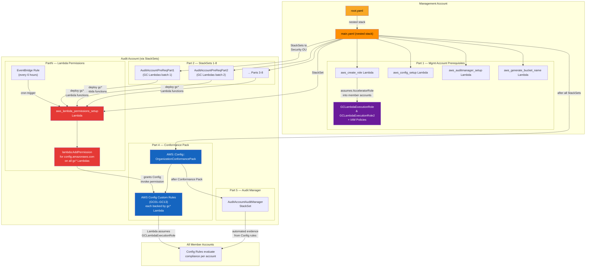
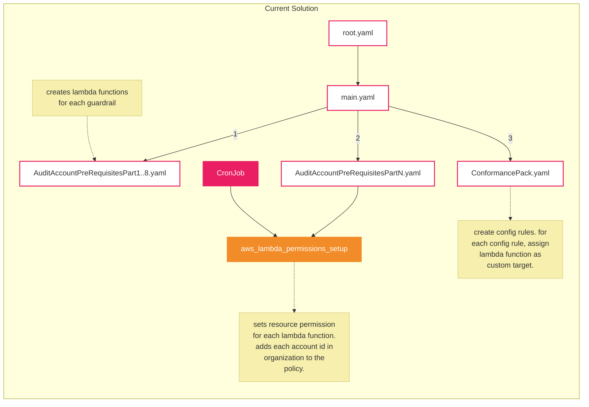

# AWS Guardrails CaC Solution — Deployment Overview

## Summary

This solution deploys the **Government of Canada Cloud Guardrails** compliance assessment framework across an AWS Organization. It uses **CloudFormation nested stacks and StackSets** to provision resources in the management account and target member accounts (primarily the Audit account), and an **AWS Config Organization Conformance Pack** to deploy custom Config rules backed by Lambda functions.

## Deployment Entry Points

Deployment is orchestrated via a `Makefile`. The primary commands are:

| Command | Description |
|---------|-------------|
| `make all` | Full clean deployment: creates S3 pipeline bucket, builds Lambda packages, and deploys the root stack |
| `make deploy` | Rebuild and redeploy the main stack |
| `make update-ssN` | Redeploy a specific StackSet (1–8) after Lambda code changes |
| `make destroy` | Tear down the entire stack |

## Deployment Flow

### 1. Pipeline Bucket Setup

An S3 **pipeline bucket** is created in the management account. All packaged CloudFormation templates and Lambda deployment artifacts are uploaded to this bucket, versioned under a `DeployVersion` prefix. A bucket policy grants read access to the entire AWS Organization.

### 2. `root.yaml` → `main.yaml`

`root.yaml` is the top-level CloudFormation template. It creates a single nested stack (`GuardRailsStack`) pointing to `main.yaml`, passing through all configuration parameters (Organization ID, Audit Account ID, Accelerator role names, breakglass accounts, etc.).

### 3. `main.yaml` — Management Account Prerequisites (Part 1)

Within `main.yaml`, the following resources are created directly in the **management account**:

- **`aws_create_role` Lambda** — Assumes the Accelerator pipeline role into each member account and creates `GCLambdaExecutionRole` and `GCLambdaExecutionRole2` with the necessary IAM policies for guardrail assessments (Config rule execution, read access to IAM/S3/CloudTrail/Organizations/etc.).
- **`aws_config_setup` Lambda** — Enables AWS Config as an Organization service and registers the Audit account as a delegated administrator.
- **`aws_auditmanager_setup` Lambda** — Enables AWS Audit Manager as an Organization service and registers the Audit account as a delegated administrator.
- **`aws_generate_bucket_name` Lambda** — Generates unique names for the evidence and AWS Config Conformance Pack S3 buckets.
- **IAM Execution Roles & Policies** — Multiple fine-grained IAM policies are attached to `GCLambdaExecutionRole` and `GCLambdaExecutionRole2` covering S3, CloudWatch Logs, IAM, CloudTrail, Organizations, CloudFront, ACM, datastores, marketplace, and encryption-in-transit checks.

### 4. `AuditAccountPreRequisitesPart1–8` + `PartN` — Audit Account StackSets (Part 2)

These are deployed as **CloudFormation StackSets** targeting the Security OU (specifically the Audit account). Each StackSet deploys a subset of guardrail Lambda functions (GC01–GC13 checks) plus supporting resources:

- **Parts 1–8**: Each part bundles a group of `gc*` Lambda functions (e.g., GC01 MFA checks, GC02 password policy, GC06 encryption at rest, GC07 encryption in transit, etc.) along with their supporting IAM roles.
- **PartN** (`AuditAccountPreRequisitesPartN`): Deploys the **`aws_lambda_permissions_setup`** Lambda, which is critical for granting AWS Config the permission to invoke each guardrail Lambda. It:
  1. Runs as a CloudFormation Custom Resource on stack create/update.
  2. Calls `lambda:AddPermission` on every `gc*` Lambda, allowing the AWS Config service principal to invoke them.
  3. Is also triggered on a **6-hour cron schedule** (via EventBridge) to keep permissions in sync as new accounts join the Organization.

### 5. Conformance Pack (Part 4)

After all StackSets complete, an **`AWS::Config::OrganizationConformancePack`** is deployed from `ConformancePack.yaml`. This:

- Defines **AWS Config Custom Rules** for each guardrail (GC01–GC13), each backed by a Lambda function in the Audit account.
- Each rule references the `GCLambdaExecutionRoleName` so Config can assume the appropriate cross-account role.
- Rules are parameterized with evidence file paths (S3 URIs to attestation documents, policy files, etc.) and organization-specific settings.
- The Conformance Pack is deployed organization-wide, evaluating compliance in every member account.

### 6. Audit Manager (Part 5)

Finally, an `AuditAccountAuditManager` StackSet deploys Audit Manager resources (custom frameworks, assessments) into the Audit account, wiring up the Config rule results as automated evidence sources.

## How Guardrail Lambda Permissions Are Set Up

```
┌─────────────────────────────────────────────────────────┐
│  AuditAccountPreRequisitesPartN (StackSet → Audit Acct) │
│                                                         │
│  1. Creates LambdaPermissionsExecutionRole (IAM)        │
│     - Allows lambda:AddPermission on gc* functions      │
│     - Allows organizations:List*/Describe*              │
│                                                         │
│  2. Deploys aws_lambda_permissions_setup Lambda          │
│     - On Create/Update: iterates all gc* Lambdas and    │
│       calls AddPermission for config.amazonaws.com      │
│     - On Cron (every 6h): re-syncs permissions          │
│                                                         │
│  3. EventBridge Rule triggers Lambda every 6 hours       │
└─────────────────────────────────────────────────────────┘
```

## How AWS Config Custom Rules Are Set Up

```
┌──────────────────────────────────────────────────────────┐
│  ConformancePack.yaml (Org Conformance Pack)             │
│                                                          │
│  For each guardrail (e.g., GC01CheckRootMFA):            │
│  ┌────────────────────────────────────────────────┐      │
│  │ AWS::Config::ConfigRule                        │      │
│  │  - Source: CUSTOM_LAMBDA                       │      │
│  │  - SourceIdentifier: arn:...:function:gc*      │      │
│  │  - InputParameters: evidence paths, settings   │      │
│  │  - Scope: all resources / specific types       │      │
│  └────────────────────────────────────────────────┘      │
│                                                          │
│  Lambda assumes GCLambdaExecutionRole into target        │
│  account, evaluates compliance, calls PutEvaluations     │
└──────────────────────────────────────────────────────────┘
```

## Adding a New Guardrail

Per `doc/ENHANCE.md`:

1. Create a new guardrail Lambda function (prefix `gc_`).
2. Add it to a new or existing `AuditAccountPreRequisitesPart` StackSet template.
3. Update `aws_lambda_permissions_setup` mappings to include the new Lambda.
4. Update `GCLambdaExecutionRole` / `GCLambdaExecutionRole2` policies if new IAM permissions are needed.
5. Add the new Config rule to `ConformancePack.yaml`.
6. Redeploy.

## Deployment Architecture Diagram



# Resource Policy Current Solution Diagram Hiren
