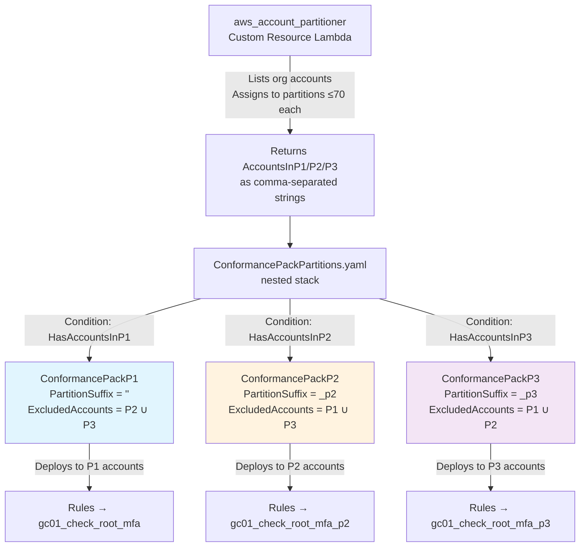

# Conformance Pack Partitioning — Proposed Solution

This document describes the proposed approach for routing per-account
guardrail evaluation through the partitioned Lambda clones introduced in
[`RESOURCE_POLICY_FIX.md`](./RESOURCE_POLICY_FIX.md). It is a companion
to that broader fix.

## Context

In the original Resource Policy Fix design document, the goal was to
have a CloudFormation Custom Resource (i.e.
**`aws_account_partitioner`**) output an Account → Partition mapping
that could be fed downstream to **`ConformancePack.yaml`** to look up
the Lambda partition to use for each account based on the
`AWS::AccountId` parameter. **However, CloudFormation doesn't support
passing `Mappings` as a template parameter (only defined in the
template), and there don't seem to be any suitable alternatives to
derive an account's partition within `ConformancePack.yaml` solely
using input parameter values.**

Therefore, we are left with the question: **how does
`ConformancePack.yaml` route each account's Config rules to the correct
partition's Lambda clone?**

The approach below answers this by deploying up to three
**Organization Conformance Packs** — one per non-empty partition —
each running the same 37-rule template but parameterised to invoke a
different Lambda clone set. `ExcludedAccounts` on each pack ensures
every org account receives **exactly one** pack: the one matching the
partition it has been assigned to in DynamoDB.

## How it would work

1. **`aws_account_partitioner`** (Custom Resource Lambda) would run
   early in `main.yaml`. It lists all org accounts, assigns each to a
   partition (≤ 70 accounts each, up to 3 partitions), and returns the
   per-partition account lists as comma-separated strings
   (`AccountsInP1` / `AccountsInP2` / `AccountsInP3`).
2. A nested CloudFormation stack would receive those three lists and
   create up to three `AWS::Config::OrganizationConformancePack`
   resources, each guarded by a `Condition` that checks whether its
   account list is non-empty.
3. Each pack would set a different `PartitionSuffix` input parameter
   on the same shared `ConformancePack.yaml` template in S3, so its 37
   Config rules invoke the matching guardrail-Lambda clone set
   (`<org>gcXX_…` / `<org>gcXX_…_p2` / `<org>gcXX_…_p3`).
4. Each pack's `ExcludedAccounts` would list every account in the
   *other* partitions, so the org-wide deployment targets each account
   from exactly one pack.

### Flow diagram



---

## Component-by-component

### 1. `ConformancePack.yaml` — parameterised rule routing

A new top-level parameter would be added:

```yaml
PartitionSuffix:
  Type: String
  Default: ""
  AllowedValues: ["", "_p2", "_p3"]
```

and appended to **every** `ConfigRuleName` and to the Lambda
function-name portion of every `SourceIdentifier`. There are 37
substitutions of each. Example:

```yaml
# Before
ConfigRuleName: gc01_check_root_mfa
Source:
  Owner: CUSTOM_LAMBDA
  SourceIdentifier:
    Fn::Join:
      - ""
      - - "arn:aws:lambda:ca-central-1:"
        - Ref: AuditAccountID
        - !Sub ":function:${OrganizationName}gc01_check_root_mfa"

# After
ConfigRuleName: !Sub "gc01_check_root_mfa${PartitionSuffix}"
Source:
  Owner: CUSTOM_LAMBDA
  SourceIdentifier:
    Fn::Join:
      - ""
      - - "arn:aws:lambda:ca-central-1:"
        - Ref: AuditAccountID
        - !Sub ":function:${OrganizationName}gc01_check_root_mfa${PartitionSuffix}"
```

So when the P2 pack passes `PartitionSuffix: "_p2"`, the deployed rule
name becomes `gc01_check_root_mfa_p2` and it targets the
`<org>gc01_check_root_mfa_p2` Lambda clone.

### 2. `ConformancePackPartitions.yaml` — the nested stack

The single inline `AWS::Config::OrganizationConformancePack` in
`main.yaml` would be replaced by a nested CloudFormation stack
containing up to three of them. The reason for using a nested stack
rather than declaring three packs directly in `main.yaml` is that
**CloudFormation `Conditions` cannot reference `!GetAtt` from a Custom
Resource** — they are evaluated at template-processing time, before
any resources (or custom resources) have run. By passing the
per-partition account lists into a nested stack as regular parameters,
the nested stack *can* use them in `Conditions`.

Inputs to the nested stack:

| Parameter | Source | Purpose |
|---|---|---|
| `AccountsInP1` / `AccountsInP2` / `AccountsInP3` | `!GetAtt InvokeAccountPartitioner.AccountsInPx` | Comma-separated lists of account IDs. Empty string when a partition has no accounts. Drives both the per-pack `Condition` and the per-pack `ExcludedAccounts`. |
| `GC03AlarmList` | (default) | Comma-separated CloudWatch alarm names forwarded to every pack as the `GC03AlarmList` input parameter. Has a hard-coded default so callers never need to set it. |
| `PipelineBucket`, `DeployVersion` | Parent | Resolve `s3://…/ConformancePack.yaml`. |
| `InvokeUpdate` | Parent | Forwarded as `UpdateTriggerVersion`. |
| `OrganizationName`, `AccelRolePrefix`, `AuditAccountID`, `BGA1-4`, `LogArchiveAccountName`, `ClientEvidenceBucket`, `GC04EnterpriseMonitoring…` | Parent | Forwarded into the `ConformancePackInputParameters` of each pack. |

Conditions:

```yaml
HasAccountsInP1: !Not [!Equals [!Ref AccountsInP1, ""]]
HasAccountsInP2: !Not [!Equals [!Ref AccountsInP2, ""]]
HasAccountsInP3: !Not [!Equals [!Ref AccountsInP3, ""]]
# AND combinations used by ExcludedAccounts !If ladders:
HasAccountsInP2AndP3: !And [!Condition HasAccountsInP2, !Condition HasAccountsInP3]
HasAccountsInP1AndP3: !And [!Condition HasAccountsInP1, !Condition HasAccountsInP3]
HasAccountsInP1AndP2: !And [!Condition HasAccountsInP1, !Condition HasAccountsInP2]
```

Resources:

| Resource | Condition | `PartitionSuffix` | `ExcludedAccounts` |
|---|---|---|---|
| `ConformancePackP1` | `HasAccountsInP1` | `""` | Nested `!If` over `(HasAccountsInP2, HasAccountsInP3)`: union of whichever of P2/P3 is non-empty, or `!Ref AWS::NoValue` if both empty. |
| `ConformancePackP2` | `HasAccountsInP2` | `"_p2"` | Nested `!If` over `(HasAccountsInP1, HasAccountsInP3)`: union of whichever of P1/P3 is non-empty, or `!Ref AWS::NoValue` if both empty. |
| `ConformancePackP3` | `HasAccountsInP3` | `"_p3"` | Nested `!If` over `(HasAccountsInP1, HasAccountsInP2)`: union of whichever of P1/P2 is non-empty, or `!Ref AWS::NoValue` if both empty. |

Pack names:

```
${OrganizationName}-GC-CP-Guardrails       ← when AccountsInP1 is non-empty (always, in practice)
${OrganizationName}-GC-CP-Guardrails-P2    ← when AccountsInP2 is non-empty
${OrganizationName}-GC-CP-Guardrails-P3    ← when AccountsInP3 is non-empty
```

For organizations with ≤ 70 active accounts the behaviour is
**indistinguishable** from the pre-fix deployment: one pack, same
name, no exclusions, base `gc*` Lambda set only. This is intentional —
the upgrade path for existing customers requires no manual
configuration.

Each pack's `ExcludedAccounts` is built with a nested `!If` ladder so
empty `AccountsInP*` strings are never `!Split`/`!Join`'d into the
list (which would produce trailing empty elements failing Config's
`^\d{12}$` validation). Worked example for `ConformancePackP1`:

```yaml
ConformancePackP1:
  Type: AWS::Config::OrganizationConformancePack
  Condition: HasAccountsInP1
  Properties:
    OrganizationConformancePackName: !Sub "${OrganizationName}-GC-CP-Guardrails"
    TemplateS3Uri: !Sub "s3://${PipelineBucket}/${DeployVersion}/ConformancePack.yaml"
    ExcludedAccounts: !If
      - HasAccountsInP2AndP3
      - !Split [",", !Join [",", [!Ref AccountsInP2, !Ref AccountsInP3]]]
      - !If
        - HasAccountsInP2
        - !Split [",", !Ref AccountsInP2]
        - !If
          - HasAccountsInP3
          - !Split [",", !Ref AccountsInP3]
          - !Ref AWS::NoValue
    ConformancePackInputParameters:
      - ParameterName: PartitionSuffix
        ParameterValue: ""
      - ParameterName: UpdateTriggerVersion
        ParameterValue: !Ref InvokeUpdate
      - ParameterName: OrganizationName
        ParameterValue: !Ref OrganizationName
      - ParameterName: AuditAccountID
        ParameterValue: !Ref AuditAccountID
      - ParameterName: GC03AlarmList
        ParameterValue: !Ref GC03AlarmList
      # … remaining input parameters (BGA1-4, S3*Path, etc.)

ConformancePackP2:
  Type: AWS::Config::OrganizationConformancePack
  Condition: HasAccountsInP2
  Properties:
    OrganizationConformancePackName: !Sub "${OrganizationName}-GC-CP-Guardrails-P2"
    TemplateS3Uri: !Sub "s3://${PipelineBucket}/${DeployVersion}/ConformancePack.yaml"
    ExcludedAccounts: !If
      - HasAccountsInP1AndP3
      - !Split [",", !Join [",", [!Ref AccountsInP1, !Ref AccountsInP3]]]
      - !If
        - HasAccountsInP1
        - !Split [",", !Ref AccountsInP1]
        - !If
          - HasAccountsInP3
          - !Split [",", !Ref AccountsInP3]
          - !Ref AWS::NoValue
    ConformancePackInputParameters:
      - ParameterName: PartitionSuffix
        ParameterValue: "_p2"
      # … same set of input parameters as P1

ConformancePackP3:
  Type: AWS::Config::OrganizationConformancePack
  Condition: HasAccountsInP3
  Properties:
    OrganizationConformancePackName: !Sub "${OrganizationName}-GC-CP-Guardrails-P3"
    TemplateS3Uri: !Sub "s3://${PipelineBucket}/${DeployVersion}/ConformancePack.yaml"
    ExcludedAccounts: !If
      - HasAccountsInP1AndP2
      - !Split [",", !Join [",", [!Ref AccountsInP1, !Ref AccountsInP2]]]
      - !If
        - HasAccountsInP1
        - !Split [",", !Ref AccountsInP1]
        - !If
          - HasAccountsInP2
          - !Split [",", !Ref AccountsInP2]
          - !Ref AWS::NoValue
    ConformancePackInputParameters:
      - ParameterName: PartitionSuffix
        ParameterValue: "_p3"
      # … same set of input parameters as P1
```

### 3. `main.yaml` — nested-stack invocation

The existing inline `AWS::Config::OrganizationConformancePack` resource
would be replaced by an `AWS::CloudFormation::Stack` resource that
delegates to `ConformancePackPartitions.yaml`. Critically the
**logical name `ConformancePack` would be preserved**, so the existing
`AuditAccountAuditManager` `DependsOn: ConformancePack` reference still
resolves without modification.

The nested stack receives only the per-partition account-list
`!GetAtt`s from the partitioner; whether each pack is created is
driven entirely by emptiness of those account lists.

### 4. `aws_account_partitioner/app.py` — per-partition account lists

Two additions:

1. **New `build_partition_account_lists` helper.** Returns a dict
   mapping every partition slot 1…`MAX_PARTITIONS` to a sorted list of
   account IDs, with empty lists for slots above the current
   `partitionCount`.
2. **`AccountsInP1` / `AccountsInP2` / `AccountsInP3` in the Custom
   Resource response.** Each is a comma-separated string of 12-digit
   account IDs (empty string when its partition has no accounts). The
   shape is the same in both invocation contexts (CloudFormation
   Custom Resource and Step Function step), produced by a shared
   `_build_cfn_response_data` helper.

The assignment algorithm itself is unchanged from the pre-fix design:
new accounts are sorted, then placed greedily into the lowest-numbered
partition with capacity, opening new partitions as needed up to
`MAX_PARTITIONS`.

If a previously-populated trailing partition becomes empty (every
account in it gets disabled / removed) the partitioner reduces
`partitionCount` to the highest occupied partition — so a 3-partition
org that loses all of P3 will report `partitionCount=2` on the next
run, and `ConformancePackP3` will be deleted on the resulting stack
update. Non-trailing partitions are *not* collapsed (P2 emptying with
P3 still occupied leaves `partitionCount=3` and only suppresses the P2
pack via its emptiness condition).

#### CloudFormation 4 KB response-body cap

The CloudFormation Custom Resource response body is capped at 4096
bytes. With `MAX_ACCOUNTS_PER_PARTITION × MAX_PARTITIONS = 70 × 3 =
210` account IDs at ~14 bytes each (12-digit + comma), the combined
`AccountsInPx` payload tops out at ~2.7 KB plus envelope, which fits
comfortably. Measured body sizes:

| Active accounts | `count` | Body size |
|---:|:---:|---:|
| 1 | 1 | 419 B |
| 70 | 1 | ~1.4 KB |
| 140 | 2 | ~2.0 KB |
| 200 | 3 | 3.2 KB |
| 210 (max) | 3 | ~3.4 KB |

### 5. `audit_manager_custom_framework.py` — 3 `controlMappingSources` per control

Each Audit Manager custom control's `controlMappingSources` list would
be expanded from one entry to three — one per partition variant — so
Audit Manager finds evaluation results regardless of which partition's
Config rule produced them. For example:

```python
# Before
"controlMappingSources": [
    {
        "sourceName": "RootMFA-check",
        "sourceSetUpOption": "System_Controls_Mapping",
        "sourceType": "AWS_Config",
        "sourceKeyword": {
            "keywordInputType": "SELECT_FROM_LIST",
            "keywordValue": "Custom_gc01_check_root_mfa-conformance-pack",
        },
    },
],

# After
"controlMappingSources": [
    {  # partition 1 — base
        "sourceName": "RootMFA-check",
        ...
        "keywordValue": "Custom_gc01_check_root_mfa-conformance-pack",
    },
    {  # partition 2
        "sourceName": "RootMFA-check-p2",
        ...
        "keywordValue": "Custom_gc01_check_root_mfa_p2-conformance-pack",
    },
    {  # partition 3
        "sourceName": "RootMFA-check-p3",
        ...
        "keywordValue": "Custom_gc01_check_root_mfa_p3-conformance-pack",
    },
],
```

`sourceName` values are suffixed to keep them unique (Audit Manager
requires uniqueness within a control). The transformation applies to
**37 of 38 controls**; `gc01_check_attestation_letter` is left at one
mapping because no Config rule by that name exists in
`ConformancePack.yaml` (this control is documentation-only and
produces no Config evaluation evidence).

Audit Manager's limit of 5 `controlMappingSources` per control is well
above the 3 we use.

#### Behaviour when a referenced Config rule doesn't exist

Audit Manager's `CreateControl` / `UpdateControl` API does not validate
that referenced Config rules actually exist — the `keywordValue` is a
soft string reference, not a foreign-key check. So in a 1-partition
(≤ 70 account) deployment where only the base
`gc01_check_root_mfa` Config rule is created, the control still ships
with all three mapping sources; the `_p2` and `_p3` sources simply
return zero evidence at collection time and contribute nothing to the
merged control. This is exactly how `gc01_check_attestation_letter`
has always behaved (it points at a non-existent rule and silently
collects no AWS Config evidence).

A welcome side-effect of this property is that the framework is
**forward-compatible with org growth**: when the organisation later
scales past 70 (or 140) accounts and `ConformancePackP2` (or `P3`)
gets deployed, the previously-empty sources start returning real
evaluations on the next collection cycle — no framework redeploy, no
manual reconciliation, no control rename.

---

## How it would behave at each scale

| Active accounts | Partitions | Packs deployed | Behaviour |
|---:|:---:|:---|:---|
| 1–70 | 1 | `…-GC-CP-Guardrails` only | Identical to pre-fix deployment. No `ExcludedAccounts`. Every account targets base `<org>gc*` Lambdas. |
| 71–140 | 2 | `…` + `…-P2` | Each pack lists the *other* partition's accounts in `ExcludedAccounts`, so every account receives exactly one pack. P1 accounts target base Lambdas; P2 accounts target `_p2` clones. |
| 141–210 | 3 | `…` + `…-P2` + `…-P3` | Each pack excludes the union of the other two partitions' accounts. Three sets of Lambda clones, three packs, every account in exactly one of them. |
| >210 | — | (failure) | Partitioner raises and the Custom Resource fails. Manual intervention required (raise `MaxAccountsPerPartition`, `MaxPartitions`, or both). |

The assignment of any specific account to a specific partition is
**stable** once made: existing rows in the
`gc-guardrails-partition-state` DynamoDB table are never reassigned by
the partitioner — only new accounts are placed.

---

## Audit Manager evidence routing

Because the three partition variants of each rule share the same Audit
Manager *control* (just with three `controlMappingSources` instead of
one), evidence aggregation in the assessment is automatic:

```
AWS Config (partition 1 accounts)  ──┐
   evaluating gc01_check_root_mfa    │
                                     ▼
AWS Config (partition 2 accounts)  ──┤    Audit Manager
   evaluating gc01_check_root_mfa_p2 ├──> control:
                                     │    "gc01_check_root_mfa"
AWS Config (partition 3 accounts)  ──┘    (single control, evidence
   evaluating gc01_check_root_mfa_p3      from all 3 sources merged)
```

`aws_compile_audit_report` consumes Audit Manager evidence folders
keyed by control *name*, not Config rule name. The control names are
unchanged by this work, so the CSV report rows continue to be grouped
by the original 38 guardrail control names regardless of how many
partitions are in play.
