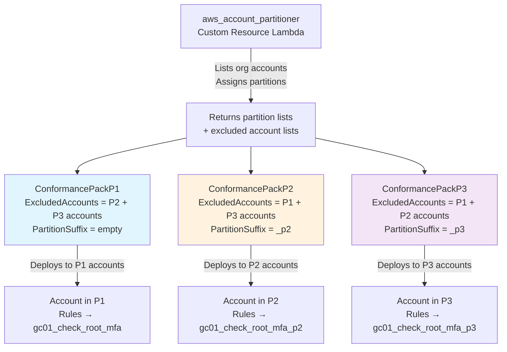
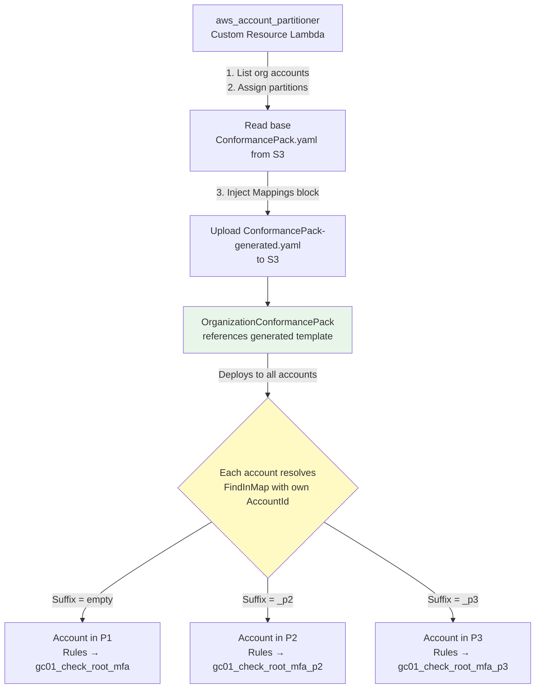

# Conformance Pack Routing — Solution Options

## Context

In the original Resource Policy Fix design document, the goal was to have a CloudFormation Custom Resource (i.e. **`aws_account_partitioner`**) output an Account --> Partition mapping that could be fed downstream to **`ConformancePack.yaml`** to lookup the lambda partition to use for each account based on the `AWS::AccountId` parameter. **However, CloudFormation doesn't support passing `Mappings` as a template parameter (only defined in the template), and there don't seem to be any suitable alternatives to derive an account's partition within `ConformancePack.yaml` solely using input parameter values.**

Therefore, we are left with the question: **how does ConformancePack.yaml route each account's Config rules to the correct partition's Lambda clone?**

## Option A: Separate Conformance Packs per Partition with `ExcludedAccounts`

### Overview

Deploy **one Conformance Pack per partition** in `main.yaml`. Each pack contains the same 37 Config rules but points at a different Lambda suffix. The `ExcludedAccounts` property on each `OrganizationConformancePack` ensures each account only receives rules from its assigned partition.

### How It Works

1. **`aws_account_partitioner`** (Custom Resource Lambda) runs early in `main.yaml`. It lists all org accounts, assigns them to partitions (≤70 each), and returns partition membership lists as outputs.
2. **`main.yaml`** creates 1–3 `AWS::Config::OrganizationConformancePack` resources, each receiving:
   - A `PartitionSuffix` parameter (`""`, `"_p2"`, or `"_p3"`)
   - An `ExcludedAccounts` list (all accounts **not** in that partition)
3. **`ConformancePack.yaml`** remains a **single, static template** in S3. It uses `PartitionSuffix` in each rule's `SourceIdentifier`:

```yaml
# ConformancePack.yaml (static — no regeneration)
Parameters:
  PartitionSuffix:
    Type: String
    Default: ""
  AuditAccountID:
    Type: String
  OrganizationName:
    Type: String
  # ... other existing parameters

Resources:
  GC01CheckRootAccountMFAEnabled:
    Type: AWS::Config::ConfigRule
    Properties:
      ConfigRuleName: !Sub "${OrganizationName}-GC01-CheckRootMFA"
      Source:
        Owner: CUSTOM_LAMBDA
        SourceIdentifier: !Sub "arn:aws:lambda:ca-central-1:${AuditAccountID}:function:${OrganizationName}gc01_check_root_mfa${PartitionSuffix}"
        SourceDetails:
          - EventSource: aws.config
            MessageType: ScheduledNotification
            MaximumExecutionFrequency: TwentyFour_Hours
```

4. **`main.yaml`** Conformance Pack resources:

```yaml
# main.yaml (simplified)
ConformancePackP1:
  Type: AWS::Config::OrganizationConformancePack
  Properties:
    OrganizationConformancePackName: !Sub "${OrganizationName}-GC-CP-Guardrails"
    ExcludedAccounts: !GetAtt AccountPartitioner.ExcludedFromP1
    ConformancePackInputParameters:
      - ParameterName: PartitionSuffix
        ParameterValue: ""
      # ... other params
    TemplateS3Uri: !Sub s3://${PipelineBucket}/${DeployVersion}/ConformancePack.yaml

ConformancePackP2:
  Type: AWS::Config::OrganizationConformancePack
  Condition: HasPartition2
  Properties:
    OrganizationConformancePackName: !Sub "${OrganizationName}-GC-CP-Guardrails-P2"
    ExcludedAccounts: !GetAtt AccountPartitioner.ExcludedFromP2
    ConformancePackInputParameters:
      - ParameterName: PartitionSuffix
        ParameterValue: "_p2"
      # ... other params
    TemplateS3Uri: !Sub s3://${PipelineBucket}/${DeployVersion}/ConformancePack.yaml

ConformancePackP3:
  Type: AWS::Config::OrganizationConformancePack
  Condition: HasPartition3
  Properties:
    OrganizationConformancePackName: !Sub "${OrganizationName}-GC-CP-Guardrails-P3"
    ExcludedAccounts: !GetAtt AccountPartitioner.ExcludedFromP3
    ConformancePackInputParameters:
      - ParameterName: PartitionSuffix
        ParameterValue: "_p3"
      # ... other params
    TemplateS3Uri: !Sub s3://${PipelineBucket}/${DeployVersion}/ConformancePack.yaml
```

### Flow Diagram



### Pros

- ✅ **ConformancePack.yaml is fully static** — git version loaded once to S3, never regenerated
- ✅ **Each account sees exactly 37 rules** — clean Config console and Audit Manager reports
- ✅ **Simple template change** — just add `${PartitionSuffix}` to existing `SourceIdentifier` lines
- ✅ **Same template reused** for all partitions via S3 URI
- ✅ **Backward compatible** — orgs with ≤70 accounts just have one pack with empty suffix (no change)

### Cons

- ⚠️ **`ExcludedAccounts` behaviour needs testing** — must confirm that:
  - It truly suppresses rule deployment (not just evaluation)
  - It accepts a list from `aws_account_partitioner` successfully
- ⚠️ **Multiple Conformance Pack resources in `main.yaml`** — up to 3 instead of 1
- ⚠️ **Audit Manager impact** — the custom framework in `audit_manager_custom_framework.py` maps controls to Config rules via `keywordValue` (e.g., `Custom_gc01_check_root_mfa-conformance-pack`). Different conformance pack names produce different rule names per partition, so each Audit Manager control would need multiple `controlMappingSources` entries (one per partition). The `aws_compile_audit_report` Lambda, which pulls evidence from Audit Manager to generate CSV reports in S3, would have gaps for P2/P3 accounts unless the framework is updated. (Note: Audit Manager is entering maintenance mode, so a future rewrite to pull directly from Config Aggregator would eliminate this coupling entirely.)

---

## Option B: Single Conformance Pack with Regenerated Template (FindInMap)

### Overview

A single `OrganizationConformancePack` with a **dynamically generated** `ConformancePack.yaml`. The `aws_account_partitioner` Lambda generates the template with a `Mappings` block that maps every account ID to its partition suffix. Each Config rule uses `Fn::FindInMap` to resolve the correct Lambda at deploy time.

### How It Works

1. **`aws_account_partitioner`** (Custom Resource Lambda) runs early in `main.yaml`. It:
   - Lists all org accounts and assigns partitions
   - Reads the base `ConformancePack.yaml` from S3
   - Injects a `Mappings` block with account-to-suffix mappings
   - Uploads the generated template to S3 (e.g., `s3://<bucket>/<version>/ConformancePack-generated.yaml`)
2. **`main.yaml`** references the generated template in the single `OrganizationConformancePack` resource.
3. **`ConformancePack-generated.yaml`** contains:

```yaml
Mappings:
  AccountPartition:
    "111111111111":
      Suffix: ""
    "222222222222":
      Suffix: ""
    "333333333333":
      Suffix: "_p2"
    "444444444444":
      Suffix: "_p3"

Resources:
  GC01CheckRootAccountMFAEnabled:
    Type: AWS::Config::ConfigRule
    Properties:
      ConfigRuleName: !Sub "${OrganizationName}-GC01-CheckRootMFA"
      Source:
        Owner: CUSTOM_LAMBDA
        SourceIdentifier: !Join
          - ""
          - - !Sub "arn:aws:lambda:ca-central-1:${AuditAccountID}:function:${OrganizationName}gc01_check_root_mfa"
            - !FindInMap [AccountPartition, !Ref "AWS::AccountId", Suffix]
        SourceDetails:
          - EventSource: aws.config
            MessageType: ScheduledNotification
            MaximumExecutionFrequency: TwentyFour_Hours
```

4. **`main.yaml`** Conformance Pack resource:

```yaml
ConformancePack:
  DependsOn:
    - AccountPartitioner
    # ... existing dependencies
  Type: AWS::Config::OrganizationConformancePack
  Properties:
    OrganizationConformancePackName: !Sub "${OrganizationName}-GC-CP-Guardrails"
    ConformancePackInputParameters:
      # ... existing params (no PartitionSuffix needed)
    TemplateS3Uri: !Sub s3://${PipelineBucket}/${DeployVersion}/ConformancePack-generated.yaml
```

### Flow Diagram



### Pros

- ✅ **Proven to work** — `Fn::FindInMap` + `Ref: AWS::AccountId` confirmed working in Conformance Packs
- ✅ **Single Conformance Pack** — one resource in `main.yaml`, one pack name, clean Audit Manager integration
- ✅ **Single Config rule name per guardrail** — consistent across all accounts, simplifies Audit Manager framework references
- ✅ **No Audit Manager changes required** — the existing `keywordValue` mappings in `audit_manager_custom_framework.py` and the `aws_compile_audit_report` evidence pipeline work as-is since all accounts see the same rule names

### Cons

- ⚠️ **Template is regenerated every deployment** — the `aws_account_partitioner` must generate and upload the template before the Conformance Pack deploys
- ⚠️ **Base template must be maintained separately** — either as a file that the Lambda reads from S3 and modifies, or generated entirely by the Lambda
- ⚠️ **Mappings block grows with accounts** — 200 accounts = 200 entries (~4KB, well within template limits)