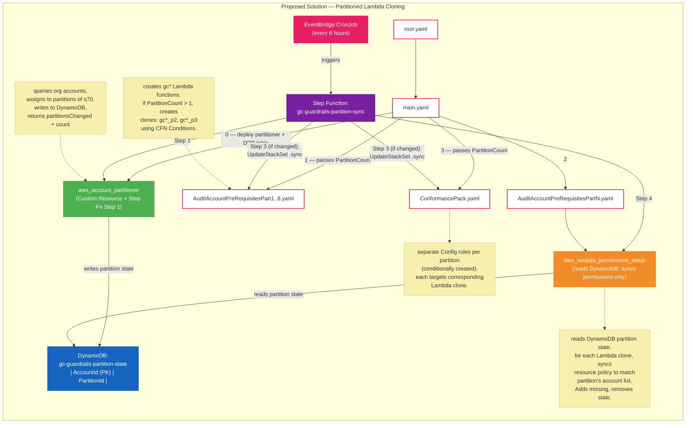

# Resource Policy Size Limit Fix — Design Document

## Problem Statement

AWS Lambda resource-based policies have a **20KB size limit**. The current `aws_lambda_permissions_setup` Lambda adds one `lambda:AddPermission` statement per AWS account in the organization to every guardrail Lambda function (`gc*`). Each statement allows `config.amazonaws.com` to invoke the Lambda on behalf of that account.

At approximately **70 accounts**, the accumulated policy statements exceed 20KB, causing `PolicyLengthExceededException` errors. SSC customers operate environments with up to **200 accounts**, making this a blocking deployment issue.

## Current Behaviour

1. `AuditAccountPreRequisitesPart1–8` each deploy a set of guardrail Lambdas (e.g., `gc01_check_root_mfa`).
2. `AuditAccountPreRequisitesPartN` deploys `aws_lambda_permissions_setup`, which iterates every org account and calls `lambda:AddPermission` on each `gc*` Lambda — one statement per account.
3. `ConformancePack.yaml` defines Config Custom Rules pointing each account's evaluation at the single `gc*` Lambda by ARN.
4. An EventBridge cron re-runs `aws_lambda_permissions_setup` every 6 hours to pick up new accounts.

**Failure mode:** When the organization grows past ~70 accounts, the per-Lambda resource policy exceeds 20KB and `AddPermission` calls fail.

## Proposed Solution — Partitioned Lambda Cloning

### Core Idea

Partition the organization's accounts into groups of **≤70** and create **one clone of each guardrail Lambda per partition**. Each clone's resource policy only contains the accounts in its partition, staying well within 20KB.

| Accounts | Partitions | Lambda copies per guardrail |
|----------|------------|-----------------------------|
| 1–70     | 1          | 1 (no change)               |
| 71–140   | 2          | 2                           |
| 141–210  | 3          | 3                           |

### Naming Convention

```
<org_name>gc01_check_root_mfa          ← partition 1 (or sole partition)
<org_name>gc01_check_root_mfa_p2       ← partition 2
<org_name>gc01_check_root_mfa_p3       ← partition 3
```

---

## New Components

### 1. DynamoDB Partition State Table

A single DynamoDB table stores the account-to-partition mapping. The schema is intentionally minimal — consuming processes reconstruct partition lists, counts, etc. at runtime.

**Table Name:** `gc-guardrails-partition-state`

| Attribute | Type | Description |
|-----------|------|-------------|
| `AccountId` (PK) | String | 12-digit AWS Account ID |
| `PartitionId` | Number | Partition number (1, 2, or 3) |

**Example items:**
```
{ "AccountId": "111111111111", "PartitionId": 1 }
{ "AccountId": "222222222222", "PartitionId": 1 }
{ "AccountId": "333333333333", "PartitionId": 2 }
```

Consumers can:
- **Get partition for an account:** `GetItem(AccountId)`.
- **Get all accounts in a partition:** `Scan` with `FilterExpression: PartitionId = :p` (≤210 items total, scan is fine).
- **Count accounts per partition:** Aggregate at runtime.
- **Get total partition count:** `max(PartitionId)` from a full scan.

The table is created in `main.yaml` alongside the partitioner Lambda.

---

### 2. Account Partition Lambda (`aws_account_partitioner`)

A new Lambda function responsible for **managing partition state**. It runs in two contexts:

- **At deployment time:** As a CloudFormation Custom Resource in `main.yaml` (initial setup).
- **Post-deployment:** As Step 1 of the Step Function orchestration (triggered by cron).

**Behaviour:**

1. Queries `organizations:ListAccounts` for all active accounts.
2. Reads current partition state from DynamoDB.
3. Identifies new accounts not yet assigned and removed/suspended accounts.
4. Assigns new accounts to existing partitions with room (< 70), or creates a new partition (up to max 3).
5. Removes entries for inactive/deleted accounts.
6. Writes updated state back to DynamoDB.
7. Returns:
   - `partitionCount` — current number of partitions.
   - `partitionsChanged` — boolean indicating if the partition count changed (i.e., a new partition was created or removed).

**CloudFormation Custom Resource outputs (at deployment):**
```yaml
PartitionCount:   # "2"
```

---

### 3. Modified `AuditAccountPreRequisitesPart1–8.yaml`

Each template receives `PartitionCount` as a parameter. Using CloudFormation `Conditions`, it conditionally creates cloned Lambda functions:

```yaml
Conditions:
  CreatePartition2: !Not [!Equals [!Ref PartitionCount, "1"]]
  CreatePartition3: !Equals [!Ref PartitionCount, "3"]

Resources:
  GC01CheckRootMFALambda:          # always created (partition 1)
    ...
  GC01CheckRootMFALambdaP2:        # created if PartitionCount >= 2
    Condition: CreatePartition2
    ...
  GC01CheckRootMFALambdaP3:        # created if PartitionCount == 3
    Condition: CreatePartition3
    ...
```

All clones share the same code package and IAM execution role — only the `FunctionName` differs.

---

### 4. Modified `ConformancePack.yaml` — Separate Config Rules Per Partition

For each guardrail, separate Config rules are conditionally created per partition. Each rule targets the corresponding Lambda clone.

**Example based on the existing `GC01CheckRootAccountMFAEnabled` rule:**

```yaml
Parameters:
  PartitionCount:
    Type: String
    Default: "1"
  # ... existing parameters ...

Conditions:
  HasPartition2: !Not [!Equals [!Ref PartitionCount, "1"]]
  HasPartition3: !Equals [!Ref PartitionCount, "3"]

Resources:
  # Partition 1 — always created (handles accounts in partition 1)
  GC01CheckRootAccountMFAEnabled:
    Type: "AWS::Config::ConfigRule"
    Properties:
      ConfigRuleName: gc01_check_root_mfa
      Description: Checks Root account to ensure MFA is enabled
      InputParameters:
        ExecutionRoleName:
          Fn::If:
            - GCLambdaExecutionRoleName
            - Ref: GCLambdaExecutionRoleName
            - Ref: AWS::NoValue
        AuditAccountID:
          Fn::If:
            - auditAccountID
            - Ref: AuditAccountID
            - Ref: AWS::NoValue
      Scope:
        ComplianceResourceTypes:
          - AWS::Account
      MaximumExecutionFrequency: TwentyFour_Hours
      Source:
        Owner: CUSTOM_LAMBDA
        SourceIdentifier:
          Fn::Join:
            - ""
            - - "arn:aws:lambda:ca-central-1:"
              - Ref: AuditAccountID
              - !Sub ":function:${OrganizationName}gc01_check_root_mfa"
        SourceDetails:
          - EventSource: aws.config
            MessageType: ScheduledNotification
            MaximumExecutionFrequency: TwentyFour_Hours

  # Partition 2 — conditionally created
  GC01CheckRootAccountMFAEnabledP2:
    Type: "AWS::Config::ConfigRule"
    Condition: HasPartition2
    Properties:
      ConfigRuleName: gc01_check_root_mfa_p2
      Description: Checks Root account to ensure MFA is enabled (Partition 2)
      InputParameters:
        ExecutionRoleName:
          Fn::If:
            - GCLambdaExecutionRoleName
            - Ref: GCLambdaExecutionRoleName
            - Ref: AWS::NoValue
        AuditAccountID:
          Fn::If:
            - auditAccountID
            - Ref: AuditAccountID
            - Ref: AWS::NoValue
      Scope:
        ComplianceResourceTypes:
          - AWS::Account
      MaximumExecutionFrequency: TwentyFour_Hours
      Source:
        Owner: CUSTOM_LAMBDA
        SourceIdentifier:
          Fn::Join:
            - ""
            - - "arn:aws:lambda:ca-central-1:"
              - Ref: AuditAccountID
              - !Sub ":function:${OrganizationName}gc01_check_root_mfa_p2"
        SourceDetails:
          - EventSource: aws.config
            MessageType: ScheduledNotification
            MaximumExecutionFrequency: TwentyFour_Hours

  # Partition 3 — conditionally created
  GC01CheckRootAccountMFAEnabledP3:
    Type: "AWS::Config::ConfigRule"
    Condition: HasPartition3
    Properties:
      ConfigRuleName: gc01_check_root_mfa_p3
      Description: Checks Root account to ensure MFA is enabled (Partition 3)
      InputParameters:
        ExecutionRoleName:
          Fn::If:
            - GCLambdaExecutionRoleName
            - Ref: GCLambdaExecutionRoleName
            - Ref: AWS::NoValue
        AuditAccountID:
          Fn::If:
            - auditAccountID
            - Ref: AuditAccountID
            - Ref: AWS::NoValue
      Scope:
        ComplianceResourceTypes:
          - AWS::Account
      MaximumExecutionFrequency: TwentyFour_Hours
      Source:
        Owner: CUSTOM_LAMBDA
        SourceIdentifier:
          Fn::Join:
            - ""
            - - "arn:aws:lambda:ca-central-1:"
              - Ref: AuditAccountID
              - !Sub ":function:${OrganizationName}gc01_check_root_mfa_p3"
        SourceDetails:
          - EventSource: aws.config
            MessageType: ScheduledNotification
            MaximumExecutionFrequency: TwentyFour_Hours
```

**Key point:** Since this is an Organization Conformance Pack, every rule is deployed to every account. Each account will have all partition rules deployed, but only the Lambda matching that account's partition will have the resource-based policy permitting invocation. Config rules targeting a Lambda without permission will fail closed (non-evaluating), which is acceptable — OR the guardrail Lambda itself can check the invoking account against DynamoDB and return `NOT_APPLICABLE` if the account isn't in its partition.

---

### 5. Modified `aws_lambda_permissions_setup` — Single Responsibility: Sync Permissions

The existing Lambda is simplified to a **single concern**: ensure each Lambda clone's resource-based policy matches the accounts in its DynamoDB partition.

**Behaviour:**

1. Read all items from `gc-guardrails-partition-state` DynamoDB table.
2. Reconstruct partition → account list mapping at runtime.
3. For each base guardrail Lambda and each partition:
   - Determine clone name (`gc*` for partition 1, `gc*_p2` for partition 2, etc.).
   - Call `GetPolicy` to read current resource-based policy statements.
   - **Add** `lambda:AddPermission` for accounts in the partition that are missing from the policy.
   - **Remove** `lambda:RemovePermission` for accounts in the policy that are no longer in the partition.
4. Return success/failure.

No state management, no account detection, no Lambda cloning. Just permission synchronization.

---

### 6. Step Function Orchestration — Post-Deployment Account Growth

A Step Function provides **observability** and **orchestration** for the ongoing sync process.

**Trigger:** EventBridge cron rule (every 6 hours).

**State Machine:**

```
┌─────────────────────────────────────────────────────────────┐
│  Step Function: gc-guardrails-partition-sync                 │
│                                                             │
│  ┌─────────────────────────┐                                │
│  │ Step 1: Invoke          │                                │
│  │ aws_account_partitioner │                                │
│  │                         │                                │
│  │ Output:                 │                                │
│  │  partitionsChanged: T/F │                                │
│  │  partitionCount: N      │                                │
│  └────────────┬────────────┘                                │
│               │                                             │
│               ▼                                             │
│  ┌─────────────────────────┐                                │
│  │ Step 2: Choice          │                                │
│  │                         │                                │
│  │ partitionsChanged?      │                                │
│  └──┬──────────────────┬───┘                                │
│     │ true             │ false                              │
│     ▼                  │                                    │
│  ┌──────────────────┐  │                                    │
│  │ Step 3: Update   │  │                                    │
│  │ StackSets        │  │                                    │
│  │ (.sync pattern)  │  │                                    │
│  │                  │  │                                    │
│  │ - Part1–8 SSets  │  │                                    │
│  │ - ConformancePack│  │                                    │
│  │   (new           │  │                                    │
│  │   PartitionCount)│  │                                    │
│  └────────┬─────────┘  │                                    │
│           │             │                                    │
│           ▼             ▼                                    │
│  ┌─────────────────────────────┐                            │
│  │ Step 4: Invoke              │                            │
│  │ aws_lambda_permissions_setup│                            │
│  │                             │                            │
│  │ Syncs resource policies     │                            │
│  │ for all Lambda clones       │                            │
│  └─────────────────────────────┘                            │
└─────────────────────────────────────────────────────────────┘
```

**Why Step Functions:**
- The `.sync` integration pattern natively waits for CloudFormation StackSet operations to complete — no Lambda timeout concerns, no polling logic.
- Full execution history for auditability and debugging.
- Built-in retry and error handling per step.
- Visual workflow in the AWS Console.

**Step 3 detail:** Uses the Step Functions AWS SDK integration to call `cloudformation:UpdateStackSet` with the `.sync` suffix. This updates `AuditAccountPreRequisitesPart1–8` and the ConformancePack with the new `PartitionCount` parameter, causing CloudFormation to create/remove Lambda clones and Config rules based on the Conditions defined in the templates.

---

## Proposed Solution Diagram



---

## Post-Deployment Account Growth Handling

The **key requirement** is that after initial deployment, when new accounts join the organization, permissions are adjusted automatically without manual redeployment.

### Flow by Scenario

| Scenario | Step Function Behaviour |
|----------|------------------------|
| New account, partition has room | Partitioner assigns account → DynamoDB. `partitionsChanged=false`. StackSet update skipped. Permissions Lambda adds `AddPermission` for the new account on the relevant clone. |
| New account, all partitions full | Partitioner creates new partition → DynamoDB. `partitionsChanged=true`. StackSet update creates new Lambda clones + Config rules. Permissions Lambda adds permissions for all accounts in the new partition. |
| Account removed/suspended | Partitioner removes from DynamoDB. Permissions Lambda calls `RemovePermission` for stale accounts. |
| >210 accounts | Partitioner logs error and raises CloudWatch alarm. Step Function fails at Step 1. Manual intervention required. |
| Step Function step fails | Built-in retry (configurable). Execution history shows exactly which step failed. Next cron in 6h retries from scratch. |

### Deployment-Time vs. Post-Deployment

| Phase | What runs | How |
|-------|-----------|-----|
| **Initial deploy** | `aws_account_partitioner` as CFN Custom Resource → outputs `PartitionCount` → StackSets use it as parameter → `aws_lambda_permissions_setup` runs as CFN Custom Resource in PartN | CloudFormation orchestrates everything |
| **Post-deploy (cron)** | Step Function: partitioner → (optional StackSet update) → permissions sync | EventBridge → Step Function |

---

## Required IAM Permissions

### `aws_account_partitioner`

```yaml
- Sid: AllowOrganizationsRead
  Action:
    - "organizations:ListAccounts"
    - "organizations:DescribeOrganization"
  Resource: "*"
  Effect: Allow
- Sid: AllowDynamoDBAccess
  Action:
    - "dynamodb:PutItem"
    - "dynamodb:DeleteItem"
    - "dynamodb:Scan"
    - "dynamodb:GetItem"
  Resource:
    - !GetAtt PartitionStateTable.Arn
  Effect: Allow
```

### `aws_lambda_permissions_setup`

```yaml
- Sid: AllowLambdaPermissions
  Action:
    - "lambda:AddPermission"
    - "lambda:RemovePermission"
    - "lambda:GetPolicy"
  Resource:
    - !Sub "arn:aws:lambda:${AWS::Region}:${AWS::AccountId}:function:${OrganizationName}gc*"
  Effect: Allow
- Sid: AllowDynamoDBRead
  Action:
    - "dynamodb:Scan"
    - "dynamodb:GetItem"
  Resource:
    - !GetAtt PartitionStateTable.Arn
  Effect: Allow
```

### Step Function Execution Role

```yaml
- Sid: AllowInvokeLambdas
  Action:
    - "lambda:InvokeFunction"
  Resource:
    - !GetAtt AccountPartitionerLambda.Arn
    - !GetAtt LambdaPermissionsLambda.Arn
  Effect: Allow
- Sid: AllowStackSetUpdates
  Action:
    - "cloudformation:UpdateStackSet"
    - "cloudformation:DescribeStackSetOperation"
  Resource:
    - !Sub "arn:aws:cloudformation:${AWS::Region}:${AWS::AccountId}:stackset/*"
  Effect: Allow
```

---

## Implementation Checklist

- [ ] Create DynamoDB table `gc-guardrails-partition-state` in `main.yaml`
- [ ] Create `src/lambda/aws_account_partitioner/` — new partition management Lambda
- [ ] Update `main.yaml` — add partitioner as Custom Resource before StackSets, add DynamoDB table, add Step Function
- [ ] Update `AuditAccountPreRequisitesPart1–8.yaml` — add conditional Lambda clones based on `PartitionCount`
- [ ] Update `ConformancePack.yaml` — add conditional Config rules per partition (as shown in section 4)
- [ ] Update `src/lambda/aws_lambda_permissions_setup/app.py`:
  - [ ] Replace hardcoded account iteration with DynamoDB read
  - [ ] Add partition-aware permission assignment (per clone)
  - [ ] Add `RemovePermission` for stale accounts
  - [ ] Remove account detection / state management logic (moved to partitioner)
- [ ] Update `AuditAccountPreRequisitesPartN.yaml` — add DynamoDB read permissions for `aws_lambda_permissions_setup`
- [ ] Create Step Function state machine definition (ASL) in `main.yaml` or separate template
- [ ] Create EventBridge rule to trigger Step Function on 6-hour schedule
- [ ] Update `doc/ENHANCE.md` — document new partition-aware guardrail addition process
- [ ] Test with 1, 70, 71, 140, 141, 200 account scenarios
