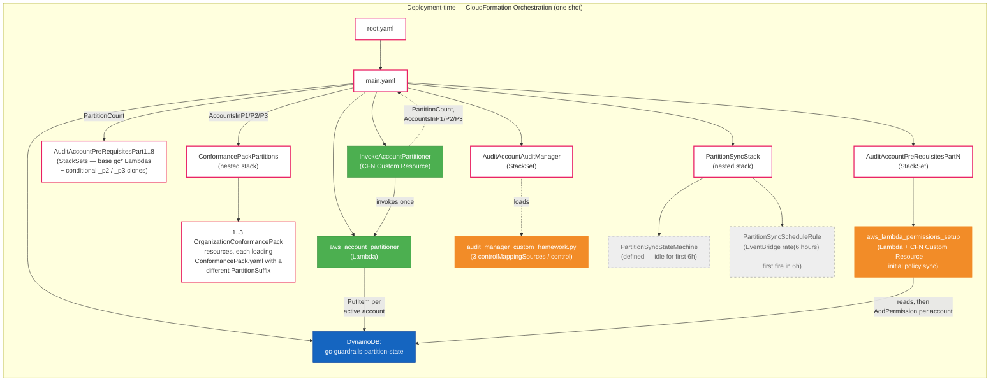
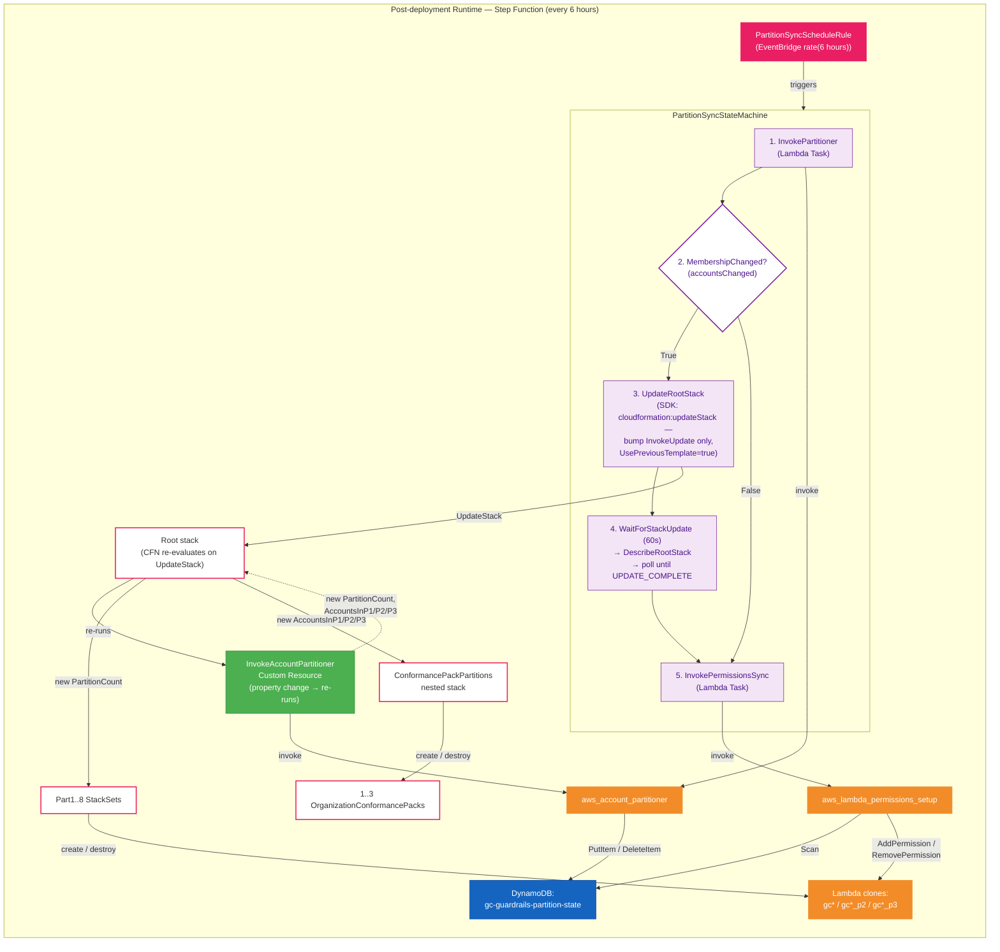

# Resource Policy Size Limit Fix — Design Document

## Problem Statement

AWS Lambda resource-based policies have a **20KB size limit**. The current `aws_lambda_permissions_setup` Lambda adds one `lambda:AddPermission` statement per AWS account in the organization to every guardrail Lambda function (`gc*`). Each statement allows `config.amazonaws.com` to invoke the Lambda on behalf of that account.

At approximately **70 accounts**, the accumulated policy statements exceed 20KB, causing `PolicyLengthExceededException` errors. SSC customers operate environments with up to **200 accounts**, making this a blocking deployment issue.

## Current Behaviour

1. `AuditAccountPreRequisitesPart1–8` each deploy a set of guardrail Lambdas (e.g., `gc01_check_root_mfa`).
2. `AuditAccountPreRequisitesPartN` deploys `aws_lambda_permissions_setup`, which iterates every org account and calls `lambda:AddPermission` on each `gc*` Lambda — one statement per account.
3. `ConformancePack.yaml` defines Config Custom Rules pointing each account's evaluation at the single `gc*` Lambda by ARN.
4. An EventBridge cron re-runs `aws_lambda_permissions_setup` every 6 hours to pick up new accounts.

**Failure mode:** When the organization grows past ~70 accounts, the per-Lambda resource policy exceeds 20KB and `AddPermission` calls fail.

## Proposed Solution — Partitioned Lambda Cloning

> **Companion document:** [`CONFORMANCE_PACK_IMPLEMENTATION.md`](./CONFORMANCE_PACK_IMPLEMENTATION.md)
> covers the conformance-pack and Audit Manager portions of this design
> (Sections 4 and 5 below) in greater depth — including the full
> `ExcludedAccounts` YAML, per-partition condition combinations, the
> CloudFormation 4 KB response-cap analysis, and Audit Manager evidence
> routing diagrams. This document is the high-level design overview.

### Core Idea

Partition the organization's accounts into groups of **≤70** and create **one clone of each guardrail Lambda per partition**. Each clone's resource policy only contains the accounts in its partition, staying well within 20KB.

| Accounts | Partitions | Lambda copies per guardrail |
|----------|------------|-----------------------------|
| 1–70     | 1          | 1 (no change)               |
| 71–140   | 2          | 2                           |
| 141–210  | 3          | 3                           |

### Naming Convention

```
<org_name>gc01_check_root_mfa          ← partition 1 (or sole partition)
<org_name>gc01_check_root_mfa_p2       ← partition 2
<org_name>gc01_check_root_mfa_p3       ← partition 3
```

---

## New Components

### 1. DynamoDB Partition State Table

A single DynamoDB table stores the account-to-partition mapping. The schema is intentionally minimal — consuming processes reconstruct partition lists, counts, etc. at runtime.

**Table Name:** `gc-guardrails-partition-state`

| Attribute | Type | Description |
|-----------|------|-------------|
| `AccountId` (PK) | String | 12-digit AWS Account ID |
| `PartitionId` | Number | Partition number (1, 2, or 3) |

**Example items:**
```
{ "AccountId": "111111111111", "PartitionId": 1 }
{ "AccountId": "222222222222", "PartitionId": 1 }
{ "AccountId": "333333333333", "PartitionId": 2 }
```

Consumers can:
- **Get partition for an account:** `GetItem(AccountId)`.
- **Get all accounts in a partition:** `Scan` with `FilterExpression: PartitionId = :p` (≤210 items total, scan is fine).
- **Count accounts per partition:** Aggregate at runtime.
- **Get total partition count:** `max(PartitionId)` from a full scan.

The table is created in `main.yaml` alongside the partitioner Lambda.

---

### 2. Account Partition Lambda (`aws_account_partitioner`)

A new Lambda function responsible for **managing partition state**. It runs in two contexts:

- **At deployment time:** As a CloudFormation Custom Resource in `main.yaml` (initial setup).
- **Post-deployment:** As Step 1 of the Step Function orchestration (triggered by cron).

**Behaviour:**

1. Queries `organizations:ListAccounts` for all active accounts.
2. Reads current partition state from DynamoDB.
3. Identifies new accounts not yet assigned and removed/suspended accounts.
4. **Greedily** assigns new (sorted) accounts to the lowest-numbered partition with room (< `MAX_ACCOUNTS_PER_PARTITION`), opening a new partition as needed up to `MAX_PARTITIONS`.
5. Removes entries for inactive/deleted accounts.
6. **Stable assignment:** existing rows in DynamoDB are never re-balanced — only new accounts are placed.
7. If a *trailing* partition becomes empty (e.g. every P3 account leaves), `partitionCount` is reduced to the highest occupied partition. Non-trailing partitions are **not** collapsed (an empty P2 with P3 still occupied leaves `partitionCount=3`).
8. Writes updated state back to DynamoDB.

**Return shape (identical in both CFN Custom Resource and Step Function contexts):**

| Field | Type | Description |
|---|---|---|
| `partitionCount` | int | Current number of partitions in use (1..`MAX_PARTITIONS`). |
| `partitionsChanged` | bool | True if `partitionCount` differs from the previous run. **Returned for observability only** — surfaced in CloudWatch logs, the Custom Resource response, and the Step Function execution history so operators can tell at a glance whether a sync run opened/collapsed a partition vs. merely added an account to an existing one. The Step Function does **not** branch on this flag (see `accountsChanged` below). |
| `accountsChanged` | bool | True if at least one account was added to, or removed from, the partition state on this run. **Critical:** the Step Function gates the root-stack UpdateStack cascade on this flag alone. It covers both the count-changing cases (opening or collapsing a partition is always accompanied by a membership change) and the count-stable case — a new account joining an existing partition with room leaves `partitionCount` unchanged, but the *other* partitions' `ExcludedAccounts` lists must still be re-rendered so the new account doesn't receive multiple Organization Conformance Packs simultaneously. Testing `partitionsChanged` in the choice would be strictly redundant. |
| `AccountsInP1` | string | Comma-separated 12-digit account IDs in partition 1. Empty string if unused. |
| `AccountsInP2` | string | As above for partition 2. |
| `AccountsInP3` | string | As above for partition 3. |

The per-partition account lists are consumed downstream by `ConformancePackPartitions.yaml` (see Section 4) to build each Organization Conformance Pack's `ExcludedAccounts`.

**CloudFormation 4 KB response-body cap.** Custom Resource response bodies are capped at 4096 bytes. With `MAX_ACCOUNTS_PER_PARTITION × MAX_PARTITIONS = 70 × 3 = 210` account IDs at ~14 bytes each (12-digit + comma), the combined `AccountsInPx` payload at 210 accounts is ~3.4 KB plus envelope — fits comfortably. Raising either limit further would require revisiting this.

---

### 3. Modified `AuditAccountPreRequisitesPart1–8.yaml`

Each template receives `PartitionCount` as a parameter. Using CloudFormation `Conditions`, it conditionally creates cloned Lambda functions:

```yaml
Conditions:
  CreatePartition2: !Not [!Equals [!Ref PartitionCount, "1"]]
  CreatePartition3: !Equals [!Ref PartitionCount, "3"]

Resources:
  GC01CheckRootMFALambda:          # always created (partition 1)
    ...
  GC01CheckRootMFALambdaP2:        # created if PartitionCount >= 2
    Condition: CreatePartition2
    ...
  GC01CheckRootMFALambdaP3:        # created if PartitionCount == 3
    Condition: CreatePartition3
    ...
```

All clones share the same code package and IAM execution role — only the `FunctionName` differs.

---

### 4. Modified `ConformancePack.yaml` + new `ConformancePackPartitions.yaml` — One Pack Per Partition

The original design considered deploying one Organization Conformance Pack containing
**three copies** of each Config rule (conditionally created per partition), with all
copies deployed to every account and the un-permitted ones failing closed.
**This was abandoned** because:

- CloudFormation `Conditions` are evaluated at template-processing time and cannot
  reference `!GetAtt` from a Custom Resource, so the per-partition account assignments
  produced by `aws_account_partitioner` cannot drive `Conditions` inside `main.yaml`.
- Fail-closed evaluations would muddy Config and Audit Manager evidence.

The adopted approach instead deploys **up to three separate `AWS::Config::OrganizationConformancePack` resources** — one per non-empty partition — each running the **same 37-rule template** (`ConformancePack.yaml`) but parameterised with a different Lambda-clone target. Per-pack `ExcludedAccounts` ensures every org account receives **exactly one** pack.

#### 4a. `ConformancePack.yaml` — single `PartitionSuffix` parameter

Rather than duplicating every rule three times, a single new input parameter is added:

```yaml
PartitionSuffix:
  Type: String
  Default: ""
  AllowedValues: ["", "_p2", "_p3"]
```

…and appended to every `ConfigRuleName` and to the Lambda function name in every
`SourceIdentifier` (37 rules × 2 substitutions). Example:

```yaml
# Before
ConfigRuleName: gc01_check_root_mfa
SourceIdentifier:
  Fn::Join: ["", ["arn:aws:lambda:ca-central-1:", !Ref AuditAccountID,
                  !Sub ":function:${OrganizationName}gc01_check_root_mfa"]]

# After
ConfigRuleName: !Sub "gc01_check_root_mfa${PartitionSuffix}"
SourceIdentifier:
  Fn::Join: ["", ["arn:aws:lambda:ca-central-1:", !Ref AuditAccountID,
                  !Sub ":function:${OrganizationName}gc01_check_root_mfa${PartitionSuffix}"]]
```

When the P2 pack passes `PartitionSuffix: "_p2"`, the deployed rule becomes
`gc01_check_root_mfa_p2` and targets the `<org>gc01_check_root_mfa_p2` Lambda clone.

#### 4b. `ConformancePackPartitions.yaml` — new nested stack

A new nested template replaces the single inline
`AWS::Config::OrganizationConformancePack` in `main.yaml`. **The logical name
`ConformancePack` is preserved** so the existing
`AuditAccountAuditManager DependsOn: ConformancePack` reference still resolves.

Why a nested stack: the per-partition account lists arrive from the partitioner as
`!GetAtt` values, which cannot be used in parent-stack `Conditions`. Passing them
into a nested stack as regular parameters lets the nested stack's `Conditions`
gate each pack on partition emptiness.

| Resource | Condition | `PartitionSuffix` | `ExcludedAccounts` |
|---|---|---|---|
| `ConformancePackP1` (`${OrganizationName}-GC-CP-Guardrails`)    | `HasAccountsInP1` | `""`    | union of P2 ∪ P3 (whichever are non-empty), or `AWS::NoValue` |
| `ConformancePackP2` (`${OrganizationName}-GC-CP-Guardrails-P2`) | `HasAccountsInP2` | `"_p2"` | union of P1 ∪ P3 (whichever are non-empty), or `AWS::NoValue` |
| `ConformancePackP3` (`${OrganizationName}-GC-CP-Guardrails-P3`) | `HasAccountsInP3` | `"_p3"` | union of P1 ∪ P2 (whichever are non-empty), or `AWS::NoValue` |

Each pack's `ExcludedAccounts` is built with a nested `!If` ladder so empty
`AccountsInP*` strings are never `!Split` into the list (which would produce
trailing empty elements that fail Config's `^\d{12}$` validation).

**Result:** every org account is targeted by exactly one pack — the one matching
its DynamoDB-assigned partition. For organisations with ≤ 70 accounts the result
is **indistinguishable from the pre-fix deployment**: one pack, no exclusions,
base `<org>gc*` Lambdas only — the upgrade path requires no manual configuration.

> See [`CONFORMANCE_PACK_IMPLEMENTATION.md`](./CONFORMANCE_PACK_IMPLEMENTATION.md)
> for the complete `ExcludedAccounts` `!If`-ladder YAML, all condition
> combinations, and the full parameter forwarding list.

---

### 5. Audit Manager custom framework — three `controlMappingSources` per control

Because Audit Manager controls reference Config rules by *name* (not ARN), each
control's `controlMappingSources` list is expanded from one entry to three —
one per partition variant (`…`, `…_p2`, `…_p3`) — so evidence is collected
regardless of which partition's Config rule produced an evaluation.

```python
"controlMappingSources": [
    {"sourceName": "RootMFA-check",     ..., "keywordValue": "Custom_gc01_check_root_mfa-conformance-pack"},
    {"sourceName": "RootMFA-check-p2",  ..., "keywordValue": "Custom_gc01_check_root_mfa_p2-conformance-pack"},
    {"sourceName": "RootMFA-check-p3",  ..., "keywordValue": "Custom_gc01_check_root_mfa_p3-conformance-pack"},
],
```

Key properties:

- Audit Manager's `CreateControl` / `UpdateControl` does **not** validate that
  the referenced Config rules exist — `keywordValue` is a soft string reference.
  At ≤ 70 accounts the `_p2` / `_p3` sources simply return zero evidence and
  contribute nothing to the merged control.
- Applies to **37 of 38 controls**; `gc01_check_attestation_letter` is documentation-only
  and stays at one mapping.
- Audit Manager's per-control limit of 5 `controlMappingSources` is well above the 3 used.
- **Forward-compatible with growth:** when an org later crosses 70 (or 140)
  accounts and `ConformancePackP2` (or `P3`) is deployed, the previously-empty
  sources start returning real evaluations on the next collection cycle — no
  framework redeploy, no control rename.

Control names themselves are unchanged, so `aws_compile_audit_report` (which
groups evidence by control name) continues to produce the same 38 CSV rows
regardless of partition count.

---

### 6. Modified `aws_lambda_permissions_setup` — Single Responsibility: Sync Permissions

The existing Lambda is simplified to a **single concern**: ensure each Lambda clone's resource-based policy matches the accounts in its DynamoDB partition.

**Behaviour:**

1. Read all items from `gc-guardrails-partition-state` DynamoDB table.
2. Reconstruct partition → account list mapping at runtime.
3. For each base guardrail Lambda and each partition:
   - Determine clone name (`gc*` for partition 1, `gc*_p2` for partition 2, etc.).
   - Call `GetPolicy` to read current resource-based policy statements.
   - **Add** `lambda:AddPermission` for accounts in the partition that are missing from the policy.
   - **Remove** `lambda:RemovePermission` for accounts in the policy that are no longer in the partition.
4. Return success/failure.

No state management, no account detection, no Lambda cloning. Just permission synchronization.

---

### 7. Step Function Orchestration — Post-Deployment Account Growth

A Step Function provides **observability** and **orchestration** for the ongoing sync process.

**Trigger:** EventBridge cron rule (every 6 hours).

**State Machine:**

```
┌─────────────────────────────────────────────────────────────┐
│  Step Function: gc-guardrails-partition-sync                 │
│                                                             │
│  ┌─────────────────────────┐                                │
│  │ Step 1: Invoke          │                                │
│  │ aws_account_partitioner │                                │
│  │                         │                                │
│  │ Output:                 │                                │
│  │  accountsChanged:   T/F │  (gates Step 2)                │
│  │  partitionCount:    N   │                                │
│  │  partitionsChanged: T/F │  (observability only)          │
│  │  AccountsInP1/P2/P3     │                                │
│  └────────────┬────────────┘                                │
│               │                                             │
│               ▼                                             │
│  ┌─────────────────────────┐                                │
│  │ Step 2: Choice          │                                │
│  │                         │                                │
│  │ MembershipChanged?      │                                │
│  │  (accountsChanged)      │                                │
│  └──┬──────────────────┬───┘                                │
│     │ true             │ false                              │
│     ▼                  │                                    │
│  ┌──────────────────┐  │                                    │
│  │ Step 3: Update   │  │                                    │
│  │ root stack       │  │                                    │
│  │ (UsePrevious-    │  │                                    │
│  │  Template=true)  │  │                                    │
│  │                  │  │                                    │
│  │ - Custom         │  │                                    │
│  │   Resource re-   │  │                                    │
│  │   runs           │  │                                    │
│  │ - Part1-8        │  │                                    │
│  │   StackSets see  │  │                                    │
│  │   new            │  │                                    │
│  │   PartitionCount │  │                                    │
│  │ - Conformance-   │  │                                    │
│  │   Pack nested    │  │                                    │
│  │   stack re-      │  │                                    │
│  │   renders with   │  │                                    │
│  │   fresh          │  │                                    │
│  │   ExcludedAccts  │  │                                    │
│  └────────┬─────────┘  │                                    │
│           │             │                                    │
│           ▼             ▼                                    │
│  ┌─────────────────────────────┐                            │
│  │ Step 4: Invoke              │                            │
│  │ aws_lambda_permissions_setup│                            │
│  │                             │                            │
│  │ Syncs resource policies     │                            │
│  │ for all Lambda clones       │                            │
│  └─────────────────────────────┘                            │
└─────────────────────────────────────────────────────────────┘
```

**Why Step Functions:**
- The `.sync` integration pattern natively waits for CloudFormation StackSet operations to complete — no Lambda timeout concerns, no polling logic.
- Full execution history for auditability and debugging.
- Built-in retry and error handling per step.
- Visual workflow in the AWS Console.

**Step 3 detail:** Uses the Step Functions AWS SDK integration to call `cloudformation:UpdateStackSet` with the `.sync` suffix. This updates `AuditAccountPreRequisitesPart1–8` with the new `PartitionCount` parameter (which conditionally creates/removes Lambda clones) and triggers re-evaluation of the `ConformancePackPartitions` nested stack, which adds or removes whole conformance packs based on which partitions are now non-empty.

---

## Proposed Solution Diagrams

The system has two distinct flows: a one-shot **deployment-time** flow
driven by CloudFormation, and a recurring **post-deployment runtime**
flow driven by an EventBridge cron and a Step Function. They are shown
separately below.

### Diagram 1 — Deployment-time (CloudFormation orchestration)

Runs once per `aws cloudformation deploy` of `root.yaml`. The partitioner
runs as a CloudFormation Custom Resource, populates the
`gc-guardrails-partition-state` DynamoDB table, and returns
`PartitionCount` + `AccountsInP1/P2/P3` as Custom Resource attributes
that the rest of the template `!GetAtt`s into the StackSets and the
nested `ConformancePack` stack. The Step Function and its EventBridge
rule are created here but do not fire until 6 hours after deployment.



### Diagram 2 — Post-deployment runtime (Step Function on 6-hour cron)

After deployment, the EventBridge rule fires every 6 hours and starts
the `PartitionSyncStateMachine`. The state machine refreshes the
partition state in DynamoDB and — whenever partition *membership*
changed (any account added to or removed from the table) — calls
`cloudformation:UpdateStack` on the root with a bumped `InvokeUpdate`
parameter. That re-runs the `InvokeAccountPartitioner` Custom Resource
(which has `InvokeUpdate: !Ref InvokeUpdate` as a property), cascading
fresh `AccountsInP1/P2/P3` into the nested `ConformancePack` stack and
fresh `PartitionCount` into the Part1-8 StackSets. The state machine
polls the root stack until `UPDATE_COMPLETE`, then invokes the
permissions Lambda to bring each clone's resource-based policy in line
with the new DynamoDB state.

> **Why the choice gates on `accountsChanged` alone.** Every partition-
> count change is necessarily accompanied by a membership change (the
> account that opened the new partition, or the removal that collapsed
> a trailing one), so `accountsChanged` is sufficient on its own —
> testing `partitionsChanged` in the choice would be strictly redundant.
> `accountsChanged` also covers the count-stable membership-change
> case: a new account joining an existing partition with room leaves
> `partitionCount` unchanged, but the *other* partitions'
> `ExcludedAccounts` lists must still be re-rendered so the new account
> doesn't simultaneously receive both the P1 pack (because it's no
> longer in P1's exclusion list) and its assigned partition's pack —
> that would produce `INSUFFICIENT_DATA` Config evaluations on the
> duplicated rules until the next CICD deploy. `partitionsChanged` is
> still returned by the partitioner and captured into the Step Function
> execution history for observability (it lets operators quickly tell a
> partition-opening run from a routine account-add), but the choice
> ignores it.



---

## Post-Deployment Account Growth Handling

The **key requirement** is that after initial deployment, when new accounts join the organization, permissions are adjusted automatically without manual redeployment.

### Behaviour at Each Scale

| Active accounts | Partitions | Packs deployed | Behaviour |
|---:|:---:|:---|:---|
| 1–70 | 1 | `…-GC-CP-Guardrails` only | **Indistinguishable from pre-fix deployment.** No `ExcludedAccounts`. Every account targets base `<org>gc*` Lambdas. |
| 71–140 | 2 | `…` + `…-P2` | Each pack lists the *other* partition's accounts in `ExcludedAccounts`, so every account receives exactly one pack. P1 accounts target base Lambdas; P2 accounts target `_p2` clones. |
| 141–210 | 3 | `…` + `…-P2` + `…-P3` | Each pack excludes the union of the other two partitions' accounts. Three sets of Lambda clones, three packs, every account in exactly one of them. |
| >210 | — | (failure) | Partitioner raises and the Custom Resource / Step Function step fails. Manual intervention required (raise `MaxAccountsPerPartition`, `MaxPartitions`, or both — but mind the CFN 4 KB response cap). |

Existing account-to-partition assignments are **stable**: they are never re-balanced, only new accounts are placed.

### Flow by Scenario

| Scenario | Step Function Behaviour |
|----------|------------------------|
| **No change** (steady state) | Partitioner sees no diff vs. DynamoDB. `accountsChanged=false` (and `partitionsChanged=false`). UpdateRootStack branch skipped. Permissions Lambda still runs and is a no-op on the resource policies. |
| **New account, partition has room** | Partitioner assigns account to a partition that's still under 70 and writes to DynamoDB. `accountsChanged=true` (`partitionsChanged=false`, since count is unchanged), so the UpdateRootStack branch fires. The root-stack update re-renders `ConformancePackPartitions` with fresh `ExcludedAccounts` lists for every pack (the new account appears in the OTHER packs' exclusion lists so it only receives its own partition's pack). Permissions Lambda then calls `AddPermission` for the new account on the relevant clone. |
| **New account, all partitions full** | Partitioner opens a new partition and writes to DynamoDB. `accountsChanged=true` (and `partitionsChanged=true`, logged for observability). UpdateRootStack branch fires; the StackSet update creates the new Lambda clones, the root re-renders `ConformancePackPartitions` which adds the new `ConformancePackP2`/`P3`. Permissions Lambda then adds permissions for all accounts in the new partition. |
| **Account removed/suspended** | Partitioner removes the account from DynamoDB. `accountsChanged=true` (and `partitionsChanged=true` if the removal empties a *trailing* partition and drops `partitionCount`, otherwise `partitionsChanged=false`). UpdateRootStack branch fires; `ConformancePackPartitions` re-renders with the removed account stripped from every `ExcludedAccounts` list. Permissions Lambda calls `RemovePermission` for the stale account on the relevant clone. |
| **>210 accounts** | Partitioner raises and the Custom Resource / Step Function step fails. CloudWatch alarm fires. Manual intervention required. |
| **Step Function step fails** | Built-in retry (configurable). Execution history shows exactly which step failed. Next cron in 6h retries from scratch. |

### Deployment-Time vs. Post-Deployment

| Phase | What runs | How |
|-------|-----------|-----|
| **Initial deploy** | `aws_account_partitioner` as CFN Custom Resource → outputs `PartitionCount` + `AccountsInP1/P2/P3` → StackSets and `ConformancePackPartitions` nested stack consume them → `aws_lambda_permissions_setup` runs as CFN Custom Resource in PartN | CloudFormation orchestrates everything |
| **Post-deploy (cron)** | Step Function: partitioner → (optional StackSet update) → permissions sync | EventBridge → Step Function |

---

## Required IAM Permissions

### `aws_account_partitioner`

```yaml
- Sid: AllowOrganizationsRead
  Action:
    - "organizations:ListAccounts"
    - "organizations:DescribeOrganization"
  Resource: "*"
  Effect: Allow
- Sid: AllowDynamoDBAccess
  Action:
    - "dynamodb:PutItem"
    - "dynamodb:DeleteItem"
    - "dynamodb:Scan"
    - "dynamodb:GetItem"
  Resource:
    - !GetAtt PartitionStateTable.Arn
  Effect: Allow
```

### `aws_lambda_permissions_setup`

```yaml
- Sid: AllowLambdaPermissions
  Action:
    - "lambda:AddPermission"
    - "lambda:RemovePermission"
    - "lambda:GetPolicy"
  Resource:
    - !Sub "arn:aws:lambda:${AWS::Region}:${AWS::AccountId}:function:${OrganizationName}gc*"
  Effect: Allow
- Sid: AllowDynamoDBRead
  Action:
    - "dynamodb:Scan"
    - "dynamodb:GetItem"
  Resource:
    - !GetAtt PartitionStateTable.Arn
  Effect: Allow
```

### Step Function Execution Role

```yaml
- Sid: AllowInvokeLambdas
  Action:
    - "lambda:InvokeFunction"
  Resource:
    - !GetAtt AccountPartitionerLambda.Arn
    - !GetAtt LambdaPermissionsLambda.Arn
  Effect: Allow
- Sid: AllowStackSetUpdates
  Action:
    - "cloudformation:UpdateStackSet"
    - "cloudformation:DescribeStackSetOperation"
  Resource:
    - !Sub "arn:aws:cloudformation:${AWS::Region}:${AWS::AccountId}:stackset/*"
  Effect: Allow
- Sid: AllowParentStackUpdate
  # Needed to re-render the ConformancePackPartitions nested stack
  # when AccountsInP1/P2/P3 change.
  Action:
    - "cloudformation:UpdateStack"
    - "cloudformation:DescribeStacks"
    - "cloudformation:DescribeStackEvents"
  Resource:
    - !Sub "arn:aws:cloudformation:${AWS::Region}:${AWS::AccountId}:stack/${AWS::StackName}/*"
  Effect: Allow
```

---

## Implementation Checklist

- [x] Create DynamoDB table `${OrganizationName}-gc-guardrails-partition-state` in `main.yaml`
- [x] Create `src/lambda/aws_account_partitioner/` — new partition management Lambda (returns `partitionCount`, `partitionsChanged`, `accountsChanged`, `AccountsInP1/P2/P3`)
- [x] Update `main.yaml` —
  - [x] Add partitioner as Custom Resource before StackSets
  - [x] Add DynamoDB table
  - [x] **Replace inline `AWS::Config::OrganizationConformancePack` with `AWS::CloudFormation::Stack` pointing at `ConformancePackPartitions.yaml`, preserving the logical name `ConformancePack`** so `AuditAccountAuditManager DependsOn` still resolves
  - [x] Add Step Function and EventBridge rule as an `AWS::CloudFormation::Stack` (`PartitionSyncStack`) pointing at `PartitionSyncStateMachine.yaml`; the 5 underlying resources live in the nested template
- [x] Update `AuditAccountPreRequisitesPart1–8.yaml` — add conditional Lambda clones based on `PartitionCount`
- [x] Update `ConformancePack.yaml` — add a single `PartitionSuffix` parameter and append `${PartitionSuffix}` to every `ConfigRuleName` and Lambda `SourceIdentifier` (37 rules × 2 substitutions)
- [x] Create `arch/templates/ConformancePackPartitions.yaml` — new nested stack creating up to 3 `OrganizationConformancePack` resources with conditional `ExcludedAccounts` `!If` ladders (see [`CONFORMANCE_PACK_IMPLEMENTATION.md`](./CONFORMANCE_PACK_IMPLEMENTATION.md))
- [x] Update `src/lambda/aws_auditmanager_resources_config_setup/audit_manager_custom_framework.py` — expand each control's `controlMappingSources` from 1 to 3 entries (one per partition variant); skip `gc01_check_attestation_letter`
- [x] Update `src/lambda/aws_lambda_permissions_setup/app.py`:
  - [x] Replace hardcoded account iteration with DynamoDB read
  - [x] Add partition-aware permission assignment (per clone)
  - [x] Add `RemovePermission` for stale accounts
  - [x] Remove account detection / state management logic (moved to partitioner)
- [x] Update `AuditAccountPreRequisitesPartN.yaml` — add DynamoDB read permissions for `aws_lambda_permissions_setup`
- [x] Create `arch/templates/PartitionSyncStateMachine.yaml` — new nested stack holding the Step Function ASL, EventBridge rule, both IAM roles, and the CloudWatch log group
  - 8 states: `InvokePartitioner` → `MembershipChanged?` → (`UpdateRootStack` → `WaitForStackUpdate` ⇄ `DescribeRootStack` → `StackUpdateComplete?`) → `InvokePermissionsSync`
  - `MembershipChanged?` triggers on `accountsChanged="True"` alone so that any membership change — including account additions to *existing* partitions (count unchanged) — cascades through the `ConformancePackPartitions` re-render. `partitionsChanged` is still surfaced in the execution context for observability but not branched on, because every partition-count change is necessarily also a membership change, so testing both would be strictly redundant.
  - `UpdateRootStack` calls `cloudformation:updateStack` on the root with `UsePreviousTemplate=true` and a single bumped `InvokeUpdate` parameter; the Custom Resource re-runs and refreshes `AccountsInP1/P2/P3`/`PartitionCount` for the nested stack and Part1-8 StackSets
  - Polls root stack status every 60 s until `UPDATE_COMPLETE`
  - `Catch` on `UpdateRootStack` falls through to `InvokePermissionsSync` if the root is mid-update (e.g. concurrent CICD deploy)
  - `root.yaml` now passes `RootStackName: !Ref AWS::StackName` so the state machine knows which stack to target (nested stacks can't be updated directly)
  - Factoring this out trimmed `main.yaml` from 85.6 KB / 2,291 lines down to 73.5 KB / 1,995 lines (-14 %)
- [x] Create EventBridge rule (`rate(6 hours)`) to trigger Step Function on a 6-hour schedule (lives in `PartitionSyncStateMachine.yaml`)
- [ ] Update `doc/ENHANCE.md` — document partition-aware guardrail addition (Lambda name + Config rule both need `${PartitionSuffix}`; Audit Manager control needs 3 mapping sources)
- [ ] Test with 1, 70, 71, 140, 141, 200 account scenarios; confirm CFN response stays under 4 KB at the upper bound

