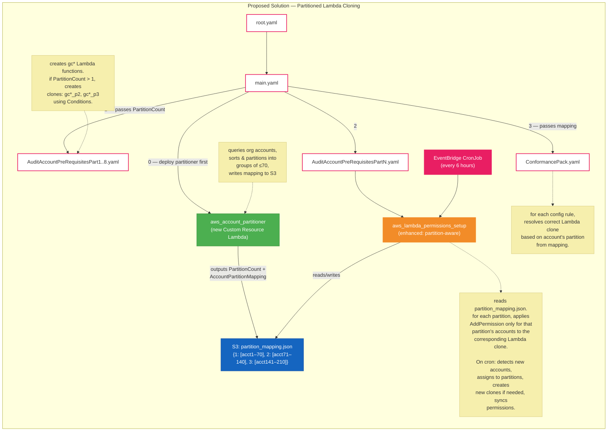
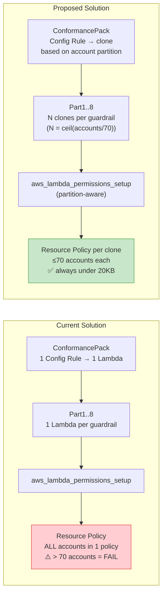

# Resource Policy Size Limit Fix — Design Document

## Problem Statement

AWS Lambda resource-based policies have a **20KB size limit**. The current `aws_lambda_permissions_setup` Lambda adds one `lambda:AddPermission` statement per AWS account in the organization to every guardrail Lambda function (`gc*`). Each statement allows `config.amazonaws.com` to invoke the Lambda on behalf of that account.

At approximately **70 accounts**, the accumulated policy statements exceed 20KB, causing `PolicyLengthExceededException` errors. SSC customers operate environments with up to **200 accounts**, making this a blocking deployment issue.

## Current Behaviour

1. `AuditAccountPreRequisitesPart1–8` each deploy a set of guardrail Lambdas (e.g., `gc01_check_root_mfa`).
2. `AuditAccountPreRequisitesPartN` deploys `aws_lambda_permissions_setup`, which iterates every org account and calls `lambda:AddPermission` on each `gc*` Lambda — one statement per account.
3. `ConformancePack.yaml` defines Config Custom Rules pointing each account's evaluation at the single `gc*` Lambda by ARN.
4. An EventBridge cron re-runs `aws_lambda_permissions_setup` every 6 hours to pick up new accounts.

**Failure mode:** When the organization grows past ~70 accounts, the per-Lambda resource policy exceeds 20KB and `AddPermission` calls fail.

## Proposed Solution — Partitioned Lambda Cloning

### Core Idea

Partition the organization's accounts into groups of **≤70** and create **one clone of each guardrail Lambda per partition**. Each clone's resource policy only contains the accounts in its partition, staying well within 20KB.

| Accounts | Partitions | Lambda copies per guardrail |
|----------|------------|-----------------------------|
| 1–70     | 1          | 1 (no change)               |
| 71–140   | 2          | 2                           |
| 141–210  | 3          | 3                           |

### Naming Convention

```
<org_name>gc01_check_root_mfa          ← partition 1 (or sole partition)
<org_name>gc01_check_root_mfa_p2       ← partition 2
<org_name>gc01_check_root_mfa_p3       ← partition 3
```

### New Components

#### 1. Account Partition Custom Resource Lambda (`aws_account_partitioner`)

A new Lambda function deployed as a **CloudFormation Custom Resource** in `main.yaml`. It:

1. Queries `organizations:ListAccounts` for all active accounts.
2. Sorts accounts deterministically (by Account ID).
3. Partitions them into groups of 70.
4. Produces CloudFormation outputs:
   - **`AccountPartitionMapping`** — JSON mapping each Account ID → partition number.
   - **`PartitionCount`** — total number of partitions.
   - **`PartitionAccounts`** — JSON mapping each partition number → list of account IDs.
5. Writes the mapping to S3 (`s3://<PipelineBucket>/<DeployVersion>/partition_mapping.json`) so downstream templates and Lambdas can consume it.

**Outputs (CloudFormation):**
```yaml
AccountPartitionMapping:   # {"111111111111": 1, "222222222222": 1, ..., "888888888888": 2}
PartitionCount:            # "2"
PartitionAccounts:         # {"1": ["111...", ...], "2": ["777...", ...]}
```

#### 2. Modified `AuditAccountPreRequisitesPart1–8.yaml`

Each template receives `PartitionCount` as a parameter. Using CloudFormation `Conditions`, it conditionally creates cloned Lambda functions:

```yaml
Conditions:
  CreatePartition2: !Not [!Equals [!Ref PartitionCount, "1"]]
  CreatePartition3: !Equals [!Ref PartitionCount, "3"]

Resources:
  GC01CheckRootMFALambda:          # always created (partition 1)
    ...
  GC01CheckRootMFALambdaP2:        # created if PartitionCount >= 2
    Condition: CreatePartition2
    ...
  GC01CheckRootMFALambdaP3:        # created if PartitionCount == 3
    Condition: CreatePartition3
    ...
```

All clones share the same code package and IAM execution role — only the `FunctionName` differs.

#### 3. Modified `ConformancePack.yaml`

The Conformance Pack receives the `AccountPartitionMapping` as a parameter. For each Config rule, a **mapping lookup** determines which Lambda clone to target based on `AWS::AccountId`:

```yaml
# Pseudo-logic per rule:
# partition = FindInMap[AccountPartitionMapping, AWS::AccountId]
# lambda_suffix = if partition == 1 then "" else "_p{partition}"
# SourceIdentifier = arn:...:function:<org>gc01_check_root_mfa{lambda_suffix}
```

Since Conformance Packs don't support `Fn::FindInMap` natively, the partition mapping is passed as an input parameter and the guardrail Lambda itself resolves the correct function name at evaluation time, OR separate Config rules per partition are conditionally created.

#### 4. Modified `aws_lambda_permissions_setup` — Partition-Aware Permissions

This is the key change for **ongoing operations** post-deployment. The existing Lambda is extended to:

1. **Fetch the partition mapping** from S3 (`partition_mapping.json`) or from its environment variables / input parameters.
2. **Detect new accounts** not present in any partition.
3. **Assign new accounts to existing partitions** if a partition has room (< 70 accounts).
4. **Create new partitions** if all existing partitions are full (triggers Lambda cloning — see below).
5. **Apply `AddPermission`** only for accounts in each partition to the corresponding Lambda clone.
6. **Write updated mappings** back to S3.

##### Pseudo-code for the enhanced `apply_lambda_permissions`:

```python
def apply_lambda_permissions():
    # 1. Get current org accounts
    current_accounts = get_accounts()  # existing function
    
    # 2. Load partition mapping from S3
    mapping = load_partition_mapping_from_s3()
    # mapping = {"partitions": {"1": ["acct1", ...], "2": [...]}, "partition_size": 70}
    
    # 3. Identify new accounts not in any partition
    all_mapped = set()
    for accts in mapping["partitions"].values():
        all_mapped.update(accts)
    
    new_accounts = [a for a in current_accounts 
                    if a["Id"] not in all_mapped and a["Status"] == "ACTIVE"]
    removed_accounts = all_mapped - {a["Id"] for a in current_accounts if a["Status"] == "ACTIVE"}
    
    # 4. Remove inactive/deleted accounts from partitions
    for partition_id, accts in mapping["partitions"].items():
        mapping["partitions"][partition_id] = [a for a in accts if a not in removed_accounts]
    
    # 5. Assign new accounts to partitions with room, or create new partitions
    for account in new_accounts:
        placed = False
        for partition_id in sorted(mapping["partitions"].keys()):
            if len(mapping["partitions"][partition_id]) < PARTITION_SIZE:
                mapping["partitions"][partition_id].append(account["Id"])
                placed = True
                break
        if not placed:
            new_partition_id = str(max(int(k) for k in mapping["partitions"].keys()) + 1)
            if int(new_partition_id) > MAX_PARTITIONS:
                raise Exception("Exceeded maximum partition count (3 / 210 accounts)")
            mapping["partitions"][new_partition_id] = [account["Id"]]
            # Trigger clone creation for the new partition
            create_lambda_clones_for_partition(new_partition_id)
    
    # 6. Apply permissions per partition per lambda
    for base_lambda_name, metadata in lambda_functions.items():
        for partition_id, accts in mapping["partitions"].items():
            clone_name = base_lambda_name if partition_id == "1" else f"{base_lambda_name}_p{partition_id}"
            sync_permissions_for_lambda(clone_name, accts)
    
    # 7. Save updated mapping to S3
    save_partition_mapping_to_s3(mapping)
```

##### New helper: `create_lambda_clones_for_partition`

When a new partition is needed at runtime (accounts grew past a boundary), the Lambda:

1. For each base `gc*` function, reads its configuration (`GetFunction`).
2. Creates a clone with suffix `_p{N}` using the same code, handler, role, timeout, and environment.
3. Applies `AddPermission` for the accounts in the new partition.

This can also be done via a CloudFormation stack update triggered by the Lambda (invoking `cloudformation:UpdateStack` on the parent StackSet), which is the preferred approach for auditability.

##### New helper: `sync_permissions_for_lambda`

Replaces the current per-account `AddPermission` loop. It:

1. Calls `GetPolicy` on the Lambda clone.
2. Compares existing authorized accounts to the partition's account list.
3. **Adds** permissions for new accounts in the partition.
4. **Removes** stale permissions for accounts no longer in the partition (accounts moved, closed, or rebalanced).

### Data Flow

```
┌───────────────────────┐
│ organizations:        │
│ ListAccounts          │
│ (200 accounts)        │
└──────────┬────────────┘
           │
           ▼
┌───────────────────────┐     ┌──────────────────────────────┐
│ aws_account_           │────▶│ S3: partition_mapping.json    │
│ partitioner Lambda     │     │ {                            │
│ (Custom Resource)      │     │   "1": [acct1..acct70],      │
│                        │     │   "2": [acct71..acct140],    │
│ - sorts accounts       │     │   "3": [acct141..acct200]   │
│ - creates partitions   │     │ }                            │
│ - outputs mapping      │     └──────────────────────────────┘
└───────────┬────────────┘               │
            │                            │
            ▼                            ▼
┌────────────────────────┐   ┌─────────────────────────────────┐
│ AuditAccountPreReq     │   │ aws_lambda_permissions_setup    │
│ Part1..8 StackSets     │   │ (enhanced)                      │
│                        │   │                                 │
│ Creates per partition: │   │ - reads partition_mapping.json  │
│  gc01_check_root_mfa   │   │ - detects new/removed accounts │
│  gc01_check_root_mfa_p2│   │ - assigns to partitions        │
│  gc01_check_root_mfa_p3│   │ - creates clones if needed     │
│  ...                   │   │ - AddPermission per partition   │
└────────────────────────┘   │ - updates mapping on S3        │
                             └─────────────────────────────────┘
```

## Proposed Solution Diagram



## Side-by-Side: Current vs. Proposed



## Post-Deployment Account Growth Handling

The **key requirement** is that after initial deployment, when new accounts join the organization, permissions are adjusted automatically without manual redeployment.

### How it works:

1. **EventBridge cron** fires every 6 hours, invoking `aws_lambda_permissions_setup` with `RequestType: "Cron"`.
2. The enhanced Lambda:
   - Calls `organizations:ListAccounts` to get current accounts.
   - Reads `partition_mapping.json` from S3.
   - Identifies accounts not yet in any partition.
   - Attempts to place them in existing partitions with room (< 70).
   - If all partitions are full, creates a new partition (up to max 3):
     - Clones each base `gc*` Lambda with `_p{N}` suffix using the `lambda:CreateFunction` API (same code, role, handler).
     - Adds the new accounts' permissions to the new clones.
   - Removes permissions for any accounts no longer active.
   - Writes updated `partition_mapping.json` back to S3.
3. **Config rules** in the Conformance Pack resolve to the correct clone at evaluation time.

### Failure Modes & Safeguards

| Scenario | Behaviour |
|----------|-----------|
| New account, partition has room | Account added to existing partition; `AddPermission` called on existing clone |
| New account, all partitions full | New partition + Lambda clones created; capped at 3 partitions (210 accounts) |
| Account removed/suspended | Permissions cleaned up on next cron run |
| >210 accounts | Lambda logs error and raises alarm; manual intervention required |
| Cron fails | Next cron in 6h retries; `AddPermission` is idempotent for existing statements |

### Required IAM Additions for `aws_lambda_permissions_setup`

The enhanced Lambda needs these additional permissions beyond the current set:

```yaml
- Sid: AllowLambdaCloneManagement
  Action:
    - "lambda:CreateFunction"
    - "lambda:GetFunction"
    - "lambda:UpdateFunctionCode"
    - "lambda:UpdateFunctionConfiguration"
    - "lambda:RemovePermission"
    - "lambda:ListTags"
    - "lambda:TagResource"
  Resource:
    - !Sub "arn:aws:lambda:${AWS::Region}:${AWS::AccountId}:function:${OrganizationName}gc*"
  Effect: Allow
- Sid: AllowS3MappingAccess
  Action:
    - "s3:GetObject"
    - "s3:PutObject"
  Resource:
    - !Sub "arn:aws:s3:::${PipelineBucket}/${DeployVersion}/partition_mapping.json"
  Effect: Allow
- Sid: AllowPassRole
  Action:
    - "iam:PassRole"
  Resource:
    - !Sub "arn:aws:iam::${AWS::AccountId}:role/${RolePrefix}*"
  Effect: Allow
```

## Implementation Checklist

- [ ] Create `src/lambda/aws_account_partitioner/` — new Custom Resource Lambda
- [ ] Update `main.yaml` — add `aws_account_partitioner` resource before StackSets
- [ ] Update `AuditAccountPreRequisitesPart1–8.yaml` — add conditional Lambda clones
- [ ] Update `ConformancePack.yaml` — partition-aware Config rule targets
- [ ] Update `src/lambda/aws_lambda_permissions_setup/app.py`:
  - [ ] Add S3 read/write for `partition_mapping.json`
  - [ ] Add partition-aware permission assignment
  - [ ] Add new account detection and partition placement
  - [ ] Add Lambda cloning logic for new partitions
  - [ ] Add stale permission cleanup
- [ ] Update `AuditAccountPreRequisitesPartN.yaml` — add new IAM permissions
- [ ] Update `doc/ENHANCE.md` — document new partition-aware guardrail addition process
- [ ] Test with 1, 70, 71, 140, 141, 200 account scenarios
